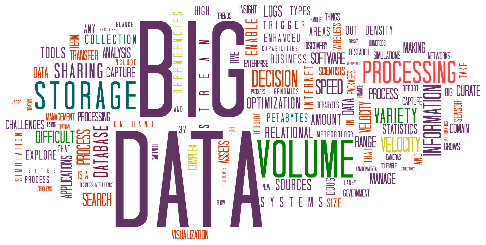
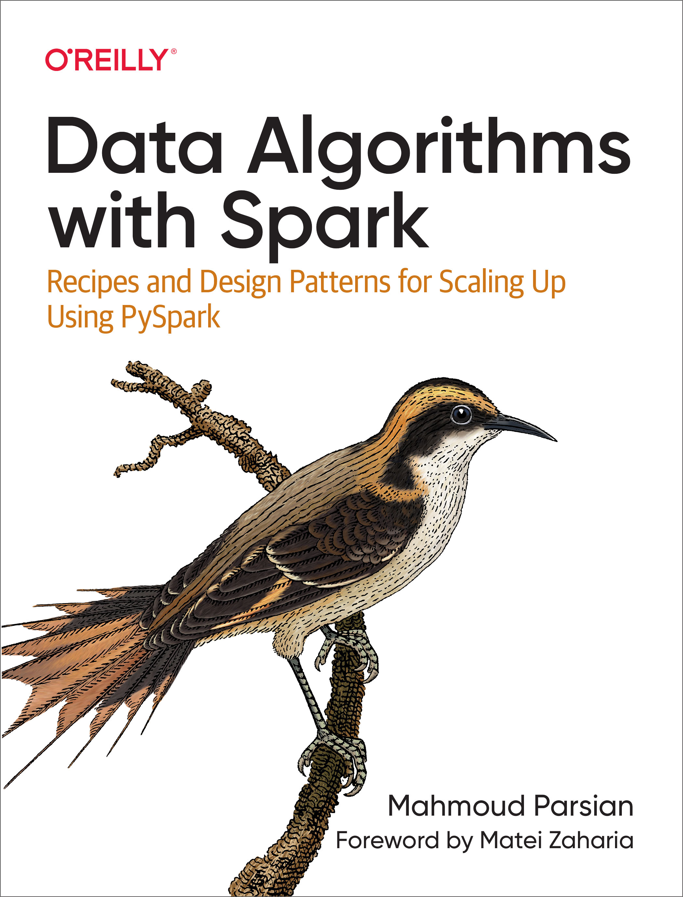
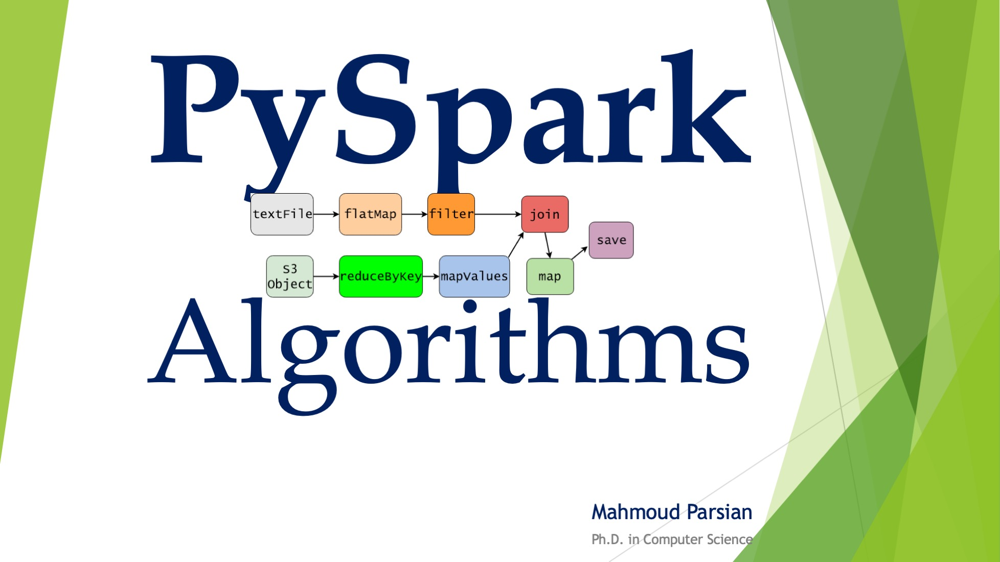
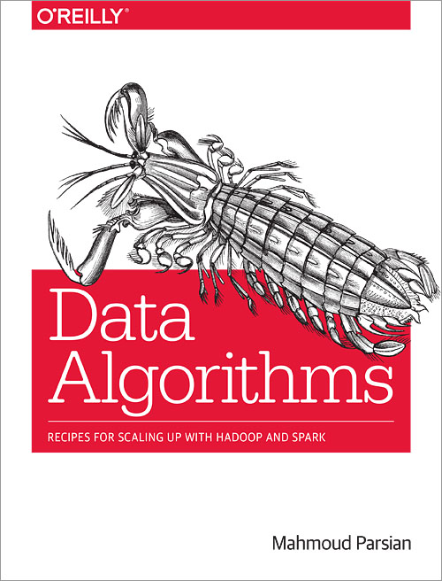

# Fall Quarter 2026
# [ISBA-2413: Big Data Modeling & Analytics](https://www.scu.edu/bulletin/graduate/leavey-school-of-business/chapter-7/information-systems-and-business-analytics-isba.html)

@author: [Dr. Mahmoud Parsian](https://www.scu.edu/business/isa/faculty/parsian/)

<!-- comment -->
<!-- This is a comment, it will not be included -->
<!-- Big Data, Big Data Modeling & Analytics -->
<!-- MapReduce, map, mapper, reduce, reducer -->
<!-- Spark, Apache Spark, PySpark, Apache PySpark, RDD, DataFrame -->
<!-- Spark, PySpark, Transformations, Actions, Partitions -->
<!-- Spark, PySpark, RDD, DataFrame, Action -->
<!-- SCU web site  URL: https://www.scu.edu/business/graduate-degrees/ms-programs/ms-business-analytics/course-descriptions/ -->
<!-- SCU web site  online URL: https://onlinedegrees.scu.edu/academics/ -->
<!-- SCU masters business analytics curriculum -->
<!-- comment -->

--------------------------

----------------------------

## 1. Course Information

	This course is about  big  data  and its role 
	in carrying out  modern business intelligence 
	for   actionable  insight   to   address  new  
	business needs. This course is a lab-led  and 
	open source software rooted course.  
	
	Students   will  learn  the  fundamentals  of 
	MapReduce, Spark  framework, NoSQL databases, 
	PySpark, and Amazon Athena.  The  class  will 
	focus  on   the   storage,   processing,  and 
	analysis aspects of  big  data. Students will 
	use Spark cluster and  MapReduce fundamentals 
	to solve big data problems.
	
## 2. Folders

| folder                                      | Description |        
|---------------------------------------------|-------------|
| [`slides`](./slides)                        | slides, lecture notes, and notebooks        |
| [`syllabus`](./syllabus/2026-Fall/README.md)| 10-weeks session-by-session syllabus        | 
| [`course_info`](./course_info)              | Course Information: grading, exams, academic conduct |
| [`data`](./data)| Samples of data for analytics       |
| [`instructor`](./instructor) | Mahmoud Parsian as Instructor |
	
## 3. Main Subjects

| Subject                             | Percentage |        
|-------------------------------------|------------|
|1. Big Data Concepts                 | 10%        |
|2. MapReduce Paradigm                | 20%        |
|3. Big Data Analytics by PySpark     | 50%        |
|4. Data Partitioning and SQL Queries | 20%        |

## 4.  [Class Room, Dates & Hours](./course_info/class_meeting_dates_and_hours.md)

## 5.  [Instructor: Dr. M. Parsian](https://www.scu.edu/business/isa/faculty/parsian/)

## 6.  [Prerequisite](./course_info/prerequisite.md)

## 7.  [Course Description](./course_info/course_description.md)

## 8.  [Course Outline](./course_info/course_outline.md)

## 9.  [Glossary of Big Data, MapReduce, Spark](./slides/glossary/glossary_of_big_data_and_mapreduce.md)

## 10.  [Required Books and Papers](./course_info/required_books.md)

## 11.  [Optional Books and References](./course_info/additional_books.md)

## 12.  [Required Software](./course_info/required_software.md)

## 13.  [Syllabus, Fall Quarter 2026](./syllabus/2026-Fall/README.md)

## 14. [Grading and Class Conduct](./course_info/grading_and_class_conduct.md)

## 15. [Academic Conduct](./course_info/academic_conduct.md)

## 16. [Python Tutorials](./course_info/python_tutorials.md)

## 17. [SQL Tutorials](./course_info/sql_tutorials.md)

## 18. [MapReduce Tutorials](./course_info/mapreduce_tutorials.md)

## 19. [PySpark Tutorials](./course_info/pyspark_tutorials.md)

## 20. [Office Hours](./course_info/office_hours.md)

## 21. [Exam-1, Exam-2, and Final Exam Dates](./course_info/exam_dates.md)

---

## Mahmoud Parsian's Latest Books

### Data Algorithms with Spark 

------

### PySpark Algorithms 

-------

### Data Algorithms 

