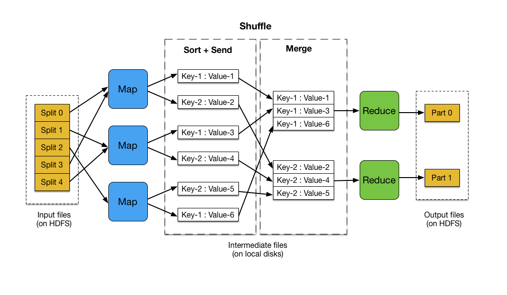
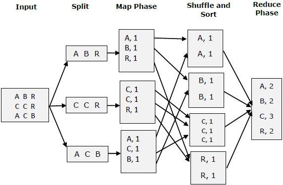
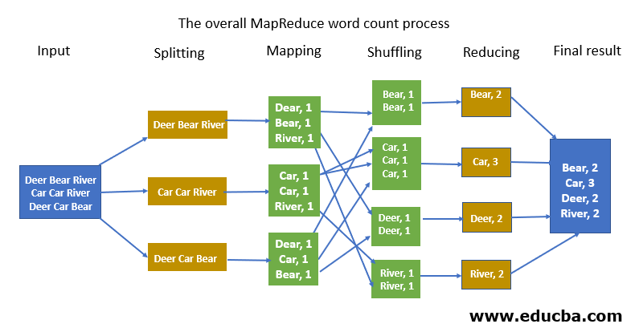

# MapReduce Tutorials

1. [Introduction to MapReduce by Mahmoud Parsian](https://mapreduce4hackers.com/docs/Introduction-to-MapReduce.pdf)

2. [Fundamentals of MapReduce with MapReduce Example](https://medium.com/edureka/mapreduce-tutorial-3d9535ddbe7c)

3. [MapReduce Algorithm Design, Jimmy Lin (PDF, 137 slides)](https://cs.uwaterloo.ca/~jimmylin/publications/WWW2013-MapReduce-tutorial-slides.pdf)

4. [Introduction to MapReduce by Fernando Chirigati, (PDF, 50 Slides)](https://vgc.poly.edu/~fchirigati/mda-class/mapreduce-intro.pdf)

5. [Google's MapReduce Programming Modell Revisited by Ralf Lammel](../slides/mapreduce/google_mapreduce_paper/Googles_MapReduce_Programming_Model_Revisited_by_Ralf_Lammel.pdf)

6. [Google's MapReduce Paper](../slides/mapreduce/google_mapreduce_paper/MapReduce_Simplified_Data_Processing_on_Large_Clusters_by_Jeff_Dean.pdf)

---

# MapReduce Flow

---

# MapReduce Example 1

---

# MapReduce Example 2

