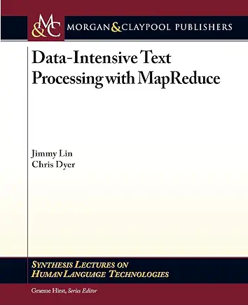
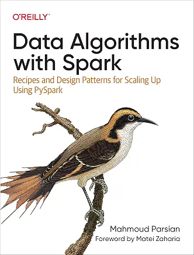

# Required Books, Papers, and Tutorials

---

# 1. Required Books (MapReduce and Spark) 

### 1. [Data-Intensive Text Processing with MapReduce by Jimmy Lin and Chris Dyer](http://lintool.github.io/MapReduceAlgorithms/ed1n/MapReduce-algorithms.pdf)
* For the first 3 weeks of class

### 2. [Data Algorithms with Spark by Mahmoud Parsian](https://www.oreilly.com/library/view/data-algorithms-with/9781492082378/)
* For the last 7 weeks of class
* [Source code @github.com -- Data Algorithms with Spark by Mahmoud Parsian](https://github.com/mahmoudparsian/data-algorithms-with-spark)  

---

# 2. Required Readings (MapReduce and Spark) 

1. [A Very Brief Introduction to MapReduce by Diana MacLean](http://hci.stanford.edu/courses/cs448g/a2/files/map_reduce_tutorial.pdf)

2. [Introduction to MapReduce by Mahmoud Parsian](http://mapreduce4hackers.com/docs/Introduction-to-MapReduce.pdf)

3. [MapReduce: Simplified Data Processing on Large Clusters, Jeffrey Dean and Sanjay Ghemawat](../slides/mapreduce/google_mapreduce_paper/MapReduce_Simplified_Data_Processing_on_Large_Clusters_by_Jeff_Dean.pdf)

4. [A Gentle Introduction to Spark by Databricks](../slides/spark/docs/A-Gentle-Introduction-to-Apache-Spark.pdf)

5. [PySpark Tutorial For Beginners (Spark with Python)](https://sparkbyexamples.com/pyspark-tutorial/)

---

# 3. Additional Books and References

[1. PySpark Algorithms by Mahmoud Parsian](https://www.amazon.com/PySpark-Algorithms-Version-Mahmoud-Parsian-ebook/dp/B07X4B2218)

[2. Source code @github.com -- PySpark Algorithms by Mahmoud Parsian](https://github.com/mahmoudparsian/pyspark-algorithms)

[3. Mining of Massive Datasets by Jure Leskovec, Anand Rajaraman, Jeffrey D. Ullman](http://infolab.stanford.edu/~ullman/mmds/book0n.pdf)

[4. Designing Good Mapreduce Algorithms by Ullman](../slides/mapreduce/introduction_to_mapreduce/Designing-Good-MapReduce-Algorithms-Ullman-2012.pdf)

[5. Bigtable: A Distributed Storage System for Structured Data](../slides/mapreduce/distributed_file_system/Bigtable_A_Distributed_Storage_System_for_Structured_Data.pdf)

[6. Relational Algebra and MapReduce](http://web.archive.org/web/20221127080039/https://www.eurecom.fr/~michiard/teaching/slides/clouds/tutorial-high_level.pdf)

[7. MapReduce examples](http://courses.cs.washington.edu/courses/cse344/11sp/sections/section8/section8-mapreduce-solution.pdf)

[8. MapReduce and relational algebra](http://www.cs.kent.edu/~jin/Cloud12Spring/DatabaseMapReduce.pptx)

[9. Spark Streaming Tutorial](https://www.edureka.co/blog/spark-streaming/)

[10. Billion Taxi Rides on Amazon Athena](https://tech.marksblogg.com/billion-nyc-taxi-rides-aws-athena.html)

[11. PySpark Cookbook](https://www.amazon.com/PySpark-Cookbook-implementing-processing-analytics/dp/1788835360/ref=sr_1_5)
