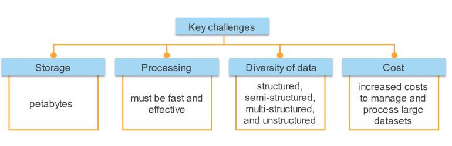
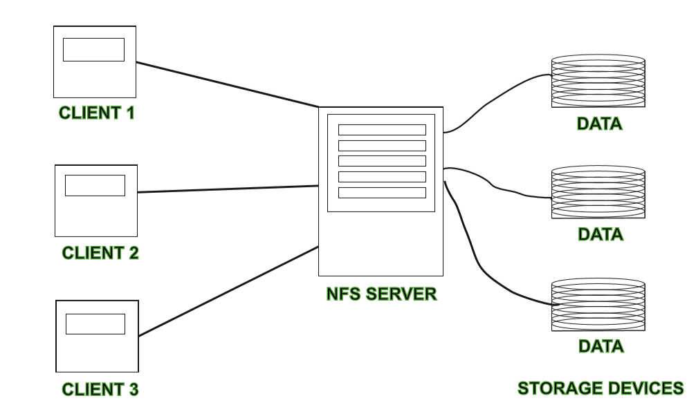
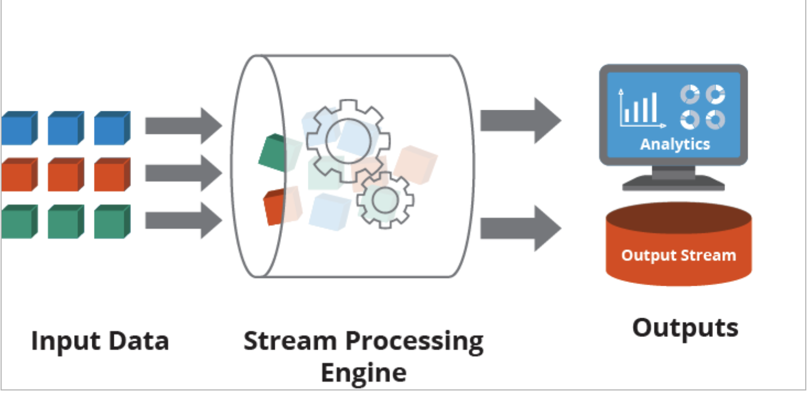
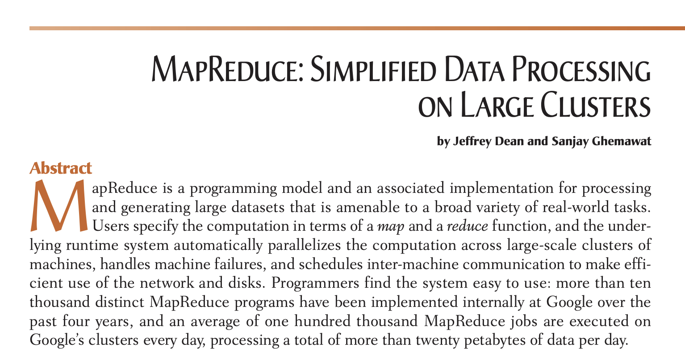
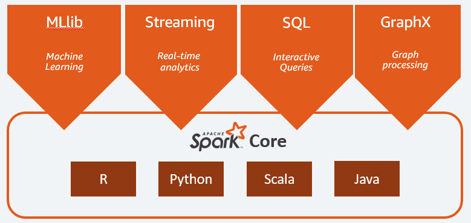
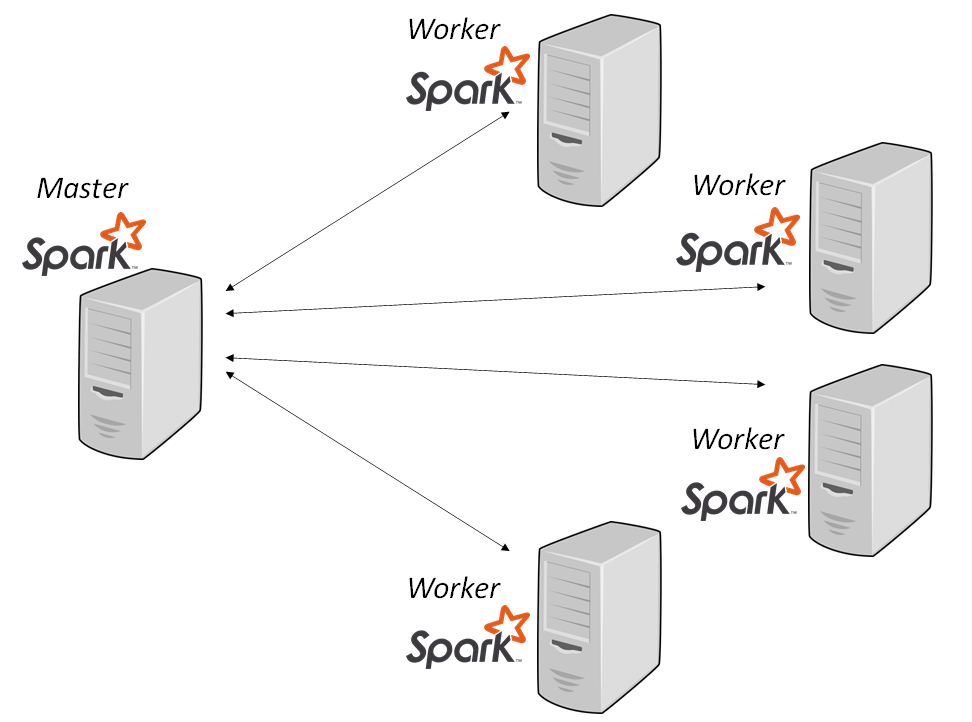
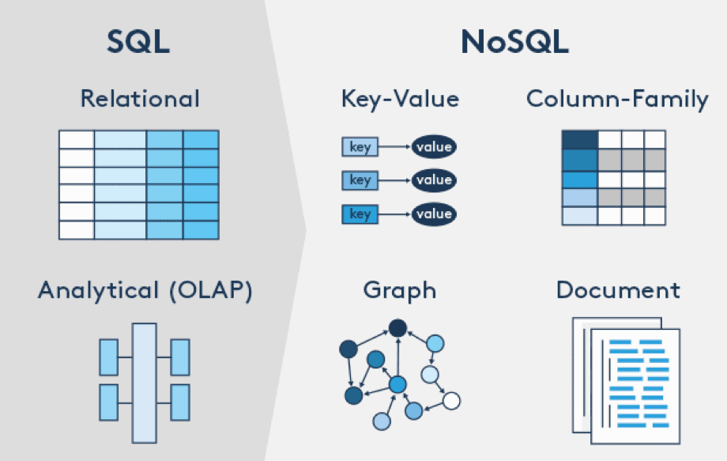

<!-- _class: lead -->

# Introduction to Big Data
## Concepts, Solutions, and Tools

Mahmoud Parsian, Ph.D. in Computer Science

---

## Agenda

1. What is Big Data? Why now?
2. The 5 V's, file formats, and types of analytics
3. Foundational concepts: scaling, CAP, ACID vs. BASE, partitioning,
   modeling, governance & security
4. The Big Data life cycle — batch, real-time, and orchestration
5. Solutions: Hadoop & MapReduce, Apache Spark, Amazon Athena, and
   the cloud platform landscape
6. Glossary, decision checklist, case study

---


## What Is Big Data?

Big Data is an umbrella term for **non-traditional strategies and
technologies** needed to:

- **Gather** data
- **Organize** data
- **Process** and **Analyze** data
- **Extract insight** from datasets too large, fast-moving, or
  varied for a single machine or traditional software tools to handle

---

## What Is Big Data? (cont'd)

- Large, complex, and constantly changing datasets
- **Cannot** be stored, managed, or processed adequately by
  traditional software and tools (e.g., a single RDBMS on one server)
- Datasets of billions of elements — measured in **terabytes** and
  **petabytes**

**Honest answer:** there is no single, universally agreed definition
— projects, vendors, and practitioners each use the term somewhat
differently. What follows is the working definition this course uses.

---

## Why Big Data, Why Now?

Explosive data growth driven by:

- **Social networking** — Twitter/X, Facebook, ...
- **Media** — Netflix, streaming, cable TV, ...
- **Commerce** — Amazon, eBay, ...
- **Health & genomics** — data growing exponentially
- Every year the world creates more **zettabytes** of data

Managing this data well is key to business expansion — in retail,
finance, media, and publishing.

---

## Examples of Big Data

- Credit card transactions
- Billions of documents indexed for a search engine
- Logs generated by web servers
- DNA & genomics data
- Twitter/X feeds, Facebook messages
- Medical records, COVID data

---



## Big Data's Key Challenges

- **Storage** — petabytes of data
- **Processing** — must be fast and effective
- **Diversity of data** — structured, semi-structured,
  multi-structured, unstructured
- **Cost** — increased cost to manage and process large datasets

---

## The 5 V's of Big Data

| V | Meaning |
|---|---|
| **Volume** | Size of the data (GB → TB → PB) |
| **Velocity** | Speed at which data is generated / must be processed |
| **Variety** | Structured, semi-structured, unstructured sources |
| **Veracity** | Quality / trustworthiness of the data |
| **Value** | Whether the data is actually worth the cost to process |

Some frameworks also call out **Complexity** as a 6th dimension
(interrelated, multi-source data that's hard to link and reconcile).

---

## Volume

- Datasets now frequently exceed:
  - **1 TB = 1,024 GB**
  - **1 PB = 1,024 TB**
- Too large to process with a regular laptop/desktop CPU
  → requires **cluster computing** + a **distributed file system**

**Example — credit cards:** 369 billion purchase transactions
worldwide in 2018.

**Example — DNA samples:** 1,000,000 samples × 5,000,000 records each
= **5 trillion data points**.

---

## Velocity

- The speed at which data is generated and must be ingested/processed
- High-velocity data needs **distributed / streaming** processing
  techniques, not batch-only tools

Examples: text messages, Twitter/X messages, Facebook posts, sensor
telemetry, credit-card swipes.

---

## Variety

Big Data comes from many kinds of sources, generally one of:

- **Structured** — rows/named columns (CSV, Parquet, RDBMS tables)
- **Semi-structured** — JSON, XML
- **Unstructured** — text files, log files, audio, video, images

High-variety data (e.g., audio/video from sensors across a city)
often needs specialized processing and algorithms.

---

## Big Data File Formats: Row vs. Columnar

- **Row-oriented** (CSV, JSON, Avro) — stores each record
  contiguously; fast to write, fast to read a whole row
  (OLTP-style access)
- **Column-oriented** (Parquet, ORC) — stores each column
  contiguously
  - Fast for analytical scans that touch few columns over many rows
  - Compresses better — similar values sit next to each other
  - What Spark, Athena, and most Big Data query engines prefer

**Rule of thumb:** row formats for streaming/transactional writes,
columnar formats for analytical reads.

---

## Veracity

- Refers to the **quality/trustworthiness** of the data
- Low veracity → high percentage of **noise** → wrong conclusions
- High veracity data (e.g., a controlled medical trial) is reliable
  enough to drive real decisions

**Garbage in, garbage out** applies at Big Data scale too — bad data
quality doesn't average out just because you have more of it.

---

## Value

- Volume, Velocity, Variety, and Veracity describe the *data itself*;
  **Value** asks whether processing it is actually **worth it**
- Not all data is worth the cost of collecting, storing, and
  processing — weigh cost against benefit before building a pipeline
- Value is usually unlocked only *after* the full life cycle: raw
  data → cleaned/aggregated → analyzed → **decision or insight**

**Data is only "Big Data" in a useful sense if someone can turn it
into value.**

---

## Types of Big Data Analytics

Four questions analytics can answer, in increasing sophistication:

| Type | Question | Example |
|---|---|---|
| **Descriptive** | What happened? | Monthly sales dashboard |
| **Diagnostic** | Why did it happen? | Root-cause of a sales dip |
| **Predictive** | What will happen? | Churn / demand forecasting |
| **Prescriptive** | What should we do? | Recommend the next best action |

Big Data enables all four at scale — more data gives more signal for
the harder predictive/prescriptive questions.

---

## Roles in the Big Data World

- **Data Engineer** — builds and operates the pipelines (ingest,
  storage, compute) covered in this deck: Spark, Kafka, Airflow, ...
- **Data Analyst / BI Analyst** — descriptive & diagnostic analytics:
  dashboards, reports
- **Data Scientist** — predictive & prescriptive analytics:
  statistical models, ML
- **ML Engineer** — productionizes and scales the models data
  scientists build

These roles overlap heavily in practice — Big Data infrastructure is
what makes all of them possible at scale.

---

## Foundational Concept: Vertical vs. Horizontal Scaling

- **Vertical scaling (scale up)** — add more CPU/RAM/disk to *one*
  machine. Simple, but has a hard ceiling and a single point of
  failure.
- **Horizontal scaling (scale out)** — add *more machines* to a
  cluster and spread the work. This is the Big Data approach:
  - 10s, 100s, or 1,000s of commodity servers
  - **Shared-nothing architecture** — each node owns its own
    CPU/memory/disk; nodes coordinate over the network instead of
    sharing physical resources
  - Fault tolerance via **replication**, not exotic hardware

---

## Foundational Concept: CAP Theorem

A distributed data store can only guarantee **two of three**
properties at the same time:

- **C**onsistency — every read sees the latest write
- **A**vailability — every request gets a (non-error) response
- **P**artition tolerance — the system keeps working despite
  network partitions between nodes

Because network partitions *will* happen at scale, real systems pick
**CP** (e.g., HBase — consistent, may reject requests during a
partition) or **AP** (e.g., Cassandra, DynamoDB — always answers, may
briefly serve stale data).

---

## Foundational Concept: ACID vs. BASE

| | ACID (traditional RDBMS) | BASE (many NoSQL / Big Data stores) |
|---|---|---|
| Stands for | Atomicity, Consistency, Isolation, Durability | Basically Available, Soft state, Eventual consistency |
| Consistency | Strong, immediate | Eventual — replicas converge over time |
| Optimized for | Correctness on a single/small cluster | Availability & scale across many nodes |

Big Data systems often trade ACID for BASE's availability and
horizontal scale — a direct consequence of the CAP theorem.

---

## Foundational Concept: Partitioning & Sharding

Splitting a dataset so no single node/file holds it all.
**Partitioning** splits data within a system (e.g., a table into
files); **sharding** spreads it across separate machines/instances.

- **Hash** — `hash(key) % N` picks the partition; even load, but
  range queries must hit every partition
- **Range** — contiguous key ranges (e.g., by date); great for range
  queries, risks hot spots
- **List / value** — one partition per discrete value (e.g., by
  `continent`) — what Athena/S3 partitioning uses (covered later)

Choosing a partition key is a **modeling decision**, driven by how
the data will be queried.

---

## Foundational Concept: Data Lake vs. Warehouse vs. Lakehouse

- **Data lake** — large repository of raw, often unstructured or
  semi-structured data, stored as-is (schema-on-read; e.g., raw
  files in S3/HDFS)
- **Data warehouse** — cleaned, integrated, well-ordered data,
  optimized for reporting/analysis (schema-on-write)
- **Data lakehouse** (modern evolution) — adds warehouse-style
  structure, ACID transactions, and schema enforcement *on top of*
  cheap lake storage (e.g., Delta Lake, Apache Iceberg, Apache Hudi)
  — you get one copy of data serving both raw and curated needs

---

## Foundational Concept: Modeling for Big Data

- **Relational modeling** — normalize to reduce redundancy; joins
  computed at query time; optimized for consistent, small updates
- **Big Data modeling** often **denormalizes** on purpose:
  - Wide, nested tables (structs/arrays) avoid expensive
    distributed joins
  - **Star / snowflake schemas** — a fact table plus dimension
    tables, still common for warehouse-style analytics
  - Trades storage (cheap) for avoiding compute-heavy joins
    (expensive at cluster scale)

**Model for how the data will be read**, not just how it's produced.

---

## Foundational Concept: Governance, Security & Privacy

- **Access control** — who can read/write which data
  (e.g., Apache Ranger, AWS IAM policies)
- **Encryption** — at rest (disk/S3) and in transit (TLS)
- **Data lineage & cataloging** — where data came from, what
  transformed it (e.g., AWS Glue Data Catalog, Hive Metastore)
- **Compliance & ethics** — regulatory requirements on sensitive
  data (GDPR, HIPAA for health/genomics data, CCPA), and awareness
  that models trained on biased data perpetuate that bias at scale
- **Auditing** — who accessed what, and when

Big Data's scale makes governance *harder* and *more necessary* —
more data, more copies, more places for it to leak.

---

## Where Do We Store Large Datasets?

- **Amazon S3** (object storage — the modern default)
- **Distributed file systems:**
  - Hadoop Distributed File System (**HDFS**)
  - Google File System (GFS)
  - NFS (Network File System)
- **NoSQL storage alternatives:**
  - Document stores — Apache CouchDB, MongoDB
  - Graph stores — Neo4j
  - Key-value stores — Apache Cassandra, Riak
  - Tabular/column stores — Apache HBase

---



## Why Distributed Storage? An NFS Example

100 file servers, 200 TB each → **20,000 TB** total raw space.

| Replication factor | Usable space |
|---|---|
| 1 | 20,000 TB |
| 2 | 10,000 TB |
| 4 | 5,000 TB |

**Replication costs money** — it trades raw capacity for fault
tolerance and read parallelism.

---

## The Big Data Life Cycle

1. **Create** data from many sources
2. **Ingest** data into the system
3. **Persist** the data in storage
4. **Compute & Analyze** the data
5. **Visualize & Present** the results

Each stage typically uses different, purpose-built tools.

---

## 1–2. Creating & Ingesting Data

Data ingestion = taking raw data and adding it to the system.
Complexity depends on source format/quality and how far it is from
the desired end state. Dedicated ingestion tools:

- **Apache Kafka** — high-throughput streaming ingestion; today's
  default choice
- **Apache Sqoop** — bulk-load from relational DBs *(retired to the
  Apache Attic; largely replaced by managed ELT tools)*
- **Apache Flume**, **Apache Chukwa** — older log/event collectors,
  still seen in legacy Hadoop deployments
- **Gobblin**

---

## 3. Persisting Data in Storage

Ingestion hands data to a storage layer that must handle volume,
availability, and distributed access reliably:

- Amazon S3
- Hadoop's HDFS
- Google File System
- NFS

---

## 4. Computing & Analyzing Data — Batch

- Split work into pieces → schedule on machines → shuffle
  intermediate results → reduce → assemble final result
- Steps: *split, map, shuffle, reduce, assemble* — a distributed
  MapReduce algorithm
- Best for very large datasets, less time-sensitive

---

## 4. Computing & Analyzing Data — Real-Time

- Processes individual items continuously as they arrive
- Pairs with **in-memory computing** to avoid disk round-trips, and
  scales **elastically** as the stream's rate changes
- Apache Storm, Apache Flink, Apache Spark (Structured Streaming)

---



## Batch vs. Real-Time, Compared

| | Batch | Real-Time / Streaming |
|---|---|---|
| Trigger | Periodic or one-time | Continuous, 24/7 |
| Latency | Minutes to hours | Milliseconds to seconds |
| Fits | Large, less urgent data | High-velocity, time-sensitive data |

---

## Lambda vs. Kappa Architecture

Two standard patterns for combining batch + real-time processing:

- **Lambda architecture** — run *both* a batch layer (accurate,
  slow) and a speed layer (approximate, fast) in parallel; merge
  results at query time
  - ✅ correctness + low latency  ❌ two code paths to maintain
- **Kappa architecture** — treat *everything* as a stream; a "batch"
  is just replaying the stream from the beginning
  - ✅ one code path  ❌ needs a stream engine that can also do full
    reprocessing (e.g., Kafka + Spark Structured Streaming)

---

## 5. Visualizing the Results

Final results are often saved to:

- ElasticSearch
- Relational databases
- Snowflake

Visualization / exploration tools:

- Jupyter Notebook
- Apache Zeppelin
- BI tools connected via JDBC/ODBC (to Athena, Snowflake, ...)

---

## Orchestrating the Pipeline

The life-cycle stages (ingest → persist → compute → visualize) don't
run themselves — a **workflow orchestrator** schedules and chains
them as a **DAG** (directed acyclic graph) of steps, handling
retries, dependencies, and failures:

- **Apache Airflow** — Python-defined DAGs, today's de facto
  standard
- **Apache Oozie** — Hadoop-native workflow scheduler
- Cloud-managed equivalents: AWS Step Functions, Google Cloud
  Composer, Azure Data Factory

---

<!-- _class: lead -->

# Big Data Solutions

MapReduce → Hadoop → Spark → Amazon Athena

---

## The Landscape of Solutions

Technologies that store, process, and analyze large quantities of
data:

- **MapReduce** — the model/paradigm
- **Apache Hadoop** — the first popular open-source implementation
- **Apache Spark** — the modern, in-memory superset of MapReduce
- **Amazon Athena**, **Google BigQuery**, **Snowflake** — serverless
  SQL-on-object-storage
- **Apache Tez** — another MapReduce-style execution engine

---

## Cloud Big Data Platforms

| Capability | AWS | Azure | Google Cloud |
|---|---|---|---|
| Object storage | S3 | Blob Storage | Cloud Storage |
| Managed Hadoop/Spark | EMR | HDInsight | Dataproc |
| Serverless SQL | **Athena** | Synapse Serverless | **BigQuery** |
| Managed Spark SaaS | Databricks | Databricks | Databricks |

This course focuses on **AWS** (S3, EMR, Athena) — the concepts
transfer directly to the other clouds' equivalents.

---



## The Paper That Started It All (2004)

*"MapReduce: Simplified Data Processing on Large Clusters"* —
Jeffrey Dean & Sanjay Ghemawat, Google, OSDI'04.

- Google built MapReduce to index billions of web documents
- Google did **not** release the code publicly
- **Apache Hadoop** was built as an open-source implementation of the
  paper's ideas, becoming an Apache project in 2006

---

## MapReduce: The Model

**MapReduce is a model/paradigm, not a product** — a way to:

1. **Partition** data into smaller chunks
2. **Parallelize** transformations on the chunked data

```text
map(input)    -> {(key1, value1), (key2, value2), ...}
reduce(key, [v1, v2, ...]) -> {(key, final_value), ...}
```

- **map** splits the problem and computes over the pieces in parallel
- **shuffle** aligns intermediate results by key
- **reduce** combines the values for each key into one output

*Full derivation and worked examples:* see
[`slides/mapreduce/mapreduce_by_Mahmoud_Parsian/`](../mapreduce/mapreduce_by_Mahmoud_Parsian/02_introduction_to_mapreduce.md).

---

## Apache Hadoop

- Framework to efficiently **store** (HDFS) and **process**
  (MapReduce) datasets from gigabytes to petabytes
- **HDFS** — distributed file system for storage
- **YARN** (Yet Another Resource Negotiator) — cluster resource
  management/scheduling
- **MapReduce** — the batch computation engine

Hadoop tools and services work together as the **Hadoop ecosystem**.

*Deep dive on HDFS:* see
[`06_introduction_to_hdfs.md`](../mapreduce/mapreduce_by_Mahmoud_Parsian/06_introduction_to_hdfs.md).

---

## The Hadoop Ecosystem

| Component | Role |
|---|---|
| HDFS | Distributed file system for storage |
| MapReduce | Parallel processing framework |
| ZooKeeper | Coordination framework |
| Hive | SQL-like interface for querying |
| Pig | High-level scripting for batch/ETL |
| HBase | Tabular/column, non-relational, distributed DB |
| Flume | Distributed service for collecting/moving data |

---

## Problems With Hadoop

- **Complex** — lots of low-level code, low-level API
- Uses **disk I/O** extensively; doesn't use RAM
  (RAM is ~100× faster than disk I/O)
- Historically **text-file-centric**
- **No multi-language support** (Java-only, originally)

**Hadoop's problems → motivated Apache Spark.**

---

## Apache Spark

Spark is a **unified engine for large-scale data analytics**:

- Multi-language engine — Python, Java, Scala, SQL, R
- Runs on a single node or a cluster
- Uses **memory/RAM first, then disk**
- Parallel processing — a **superset of MapReduce**
- **Data partitioning** for parallelism, built-in scalability
- Data abstractions: **RDDs** and **DataFrames**
- Enables **SQL access** to Big Data (Spark SQL)

---



## Spark's Unified Stack

Spark Core, with higher-level libraries built on top:

- **Spark SQL** — interactive queries over structured data
- **Structured Streaming** — real-time analytics
- **MLlib** — machine learning
- **GraphX** — graph processing

All accessible from **Python, Scala, Java, or R**.

---



## Spark Cluster Architecture

- **Driver program** — runs your `SparkContext`, plans the job
- **Cluster manager** — allocates resources across the cluster
- **Worker nodes** — each runs an **Executor** that runs **Tasks**
  in parallel

The driver splits work into tasks and ships them to executors, which
process data partitions in parallel and report results back.

---

## PySpark Example: Word Count

```python
# word_frequencies : {(word1, freq1), (word2, freq2), ...}
input_path = "s3://my_bucket/project23/"
# spark: an instance of SparkSession
word_frequencies = (
    spark.sparkContext.textFile(input_path)
         .flatMap(lambda x: x.split(' '))
         .map(lambda x: (x, 1))
         .reduceByKey(lambda a, b: a + b)
)
```

Same MapReduce *model* as before — expressed in ~4 lines instead of
a full Java MapReduce job.

*More worked examples:* [`slides/mapreduce/.../03_word_count_in_python.md`](../mapreduce/mapreduce_by_Mahmoud_Parsian/03_word_count_in_python.md)

---

## Hadoop vs. Spark

| | Hadoop | Spark |
|---|---|---|
| Programs | Long, complex, low-level API | Short, simple, high-level API |
| Languages | Java | Python, Java, Scala, SQL |
| Speed | Slow — disk I/O bound | Fast — uses RAM as much as possible |
| Processing | Parallel (MapReduce) | Parallel (superset of MapReduce) |
| Maturity | Established, older | De facto standard for new work |

**Spark is generally the better default choice today** for new Big
Data processing pipelines.

---

## SQL Access to Big Data

Multiple technologies now offer SQL-like access on top of Big Data
storage:

- **Amazon Athena** (JDBC), **Snowflake** (JDBC), **Impala**, **Hive**,
  **Trino/Presto**
- **Spark SQL** — SQL access to Spark DataFrames

Used for: data-science sandboxes, ad-hoc analytics, search indexes
over multi-structured data, data visualization pipelines.

---

<!-- _class: lead -->

# Amazon Athena

Serverless SQL on data already sitting in S3

---

## What Is Amazon Athena?

- **Interactive, serverless SQL query service** on AWS
- Analyzes data **directly in Amazon S3** — no data movement required
- **Serverless:**
  - No cluster to set up or manage
  - **Pay-per-query** — you pay only for data scanned
    (~$5 per TB scanned)
- Built on **Trino/Presto** (originated as Facebook's PrestoDB;
  Athena's newer engine versions run on Trino)
- Supports CSV, JSON, ORC, Avro, **Parquet**, and more
- Client access via a web console or **JDBC/ODBC**

---

## Athena Concepts

- **Database** — a logical grouping (catalog) of tables
- **Table** — metadata describing your data; the actual data lives
  in S3. Deleting a table does **not** delete the underlying S3 data
- **SerDe** (Serializer/Deserializer) — tells Athena/Hive how to
  parse a given data format
- Optimized for **columnar formats** (Parquet, ORC); data can also
  be compressed (e.g., GZIP) to cut scan cost

---

## Amazon Athena: Use Cases

- Ad-hoc querying of logs, genomics/DNA data, or social data in S3
  when latency isn't critical
- Going **fully serverless**: API Gateway → Lambda → Athena → S3,
  with no persistent compute to manage
- Mixing AWS services: run an on-demand **EMR** job to produce
  results in S3, then query them with Athena
- **Note:** no traditional multi-statement transactions (Athena does
  support single-table ACID operations on Apache Iceberg tables)

*Full tutorial with partitioning walkthrough:*
[`slides/amazon_athena/`](../amazon_athena/README.md).

---

## Considering a Big Data Solution?

Ask before reaching for Hadoop/Spark/Athena — one question per V:

- Does the problem require handling high **volume**?
- Does it require handling high **velocity**?
- Does it require handling **variety** of data types?
- Can you trust the data's **veracity** enough to act on it?
- Will the **value** extracted justify the cost of the solution?
- Can the solution handle the **complexity**, and can it be
  **optimized** for cost and speed?

If the answer to all of these is "no," a traditional RDBMS may still
be the right tool.

---



## Where Do NoSQL Stores Fit In?

NoSQL databases trade strict relational guarantees for flexibility
and distributed-first architecture — a natural fit for Big Data:

- **Key-Value** — Cassandra, Riak
- **Column-Family** — HBase
- **Document** — MongoDB, CouchDB
- **Graph** — Neo4j
- **SQL-on-Big-Data** — Spark SQL, Amazon Athena, BigQuery, Snowflake

---

## Big Data Glossary

- **Batch processing** — process data in large, non-time-sensitive
  sets; start the job, get results later
- **Cluster computing** — pooling multiple machines' resources under
  a management layer that coordinates work and communication
- **Data lake** — large repository of raw, relatively unstructured
  collected data
- **Data warehouse** — cleaned, integrated, well-ordered data for
  analysis/reporting
- **ETL** — Extract, Transform, Load: preparing raw data for use

---

## Big Data Glossary (cont'd)

- **Data mining** — finding patterns in large datasets
- **In-memory computing** — keeping working data and intermediate
  results in cluster memory instead of writing to disk between steps
  (Spark's core speed advantage over Hadoop MapReduce)
- **Machine learning** — systems that learn/improve from data via
  predictive and statistical algorithms
- **NoSQL** — databases designed outside the relational model,
  often distributed-first
- **Stream processing** — computing over individual items
  continuously as they arrive

---

## Case Study: Social Media Analytics

Using people's online history — purchases, searches — to build a
picture of attitude toward a product or brand.

These outputs feed downstream analyses such as:

- Customer satisfaction
- Churn prediction
- Financial performance
- Stock performance

---

## Summary

- **Big Data** = data too large/fast/varied for traditional tools —
  characterized by the **5 V's** (Volume, Velocity, Variety,
  Veracity, Value)
- Handling it requires **horizontal scaling**: cluster computing +
  distributed storage, with trade-offs described by **CAP** and
  **ACID vs. BASE**
- **MapReduce** is the foundational model; **Hadoop** was the first
  popular implementation; **Spark** is today's in-memory, multi-language
  default

---

## Summary (cont'd)

- **Amazon Athena** (and peers like BigQuery/Snowflake) offer
  **serverless SQL** directly on data in object storage — one of
  several equivalent options across AWS, Azure, and Google Cloud
- Modeling, partitioning, governance, and orchestration turn raw
  storage + compute into a **usable, safe, maintainable** pipeline
- Choice of tool follows from the life-cycle stage (ingest, persist,
  compute, visualize) and the workload's V's

---

<!-- _class: lead -->

# Questions?

Mahmoud Parsian
Ph.D. in Computer Science
