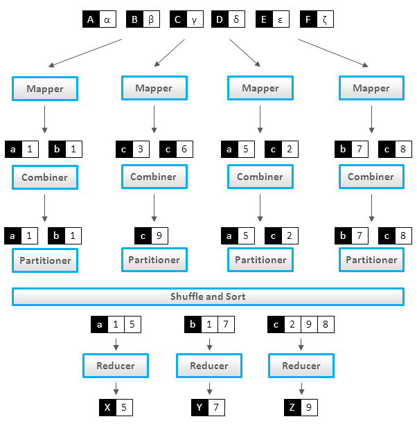
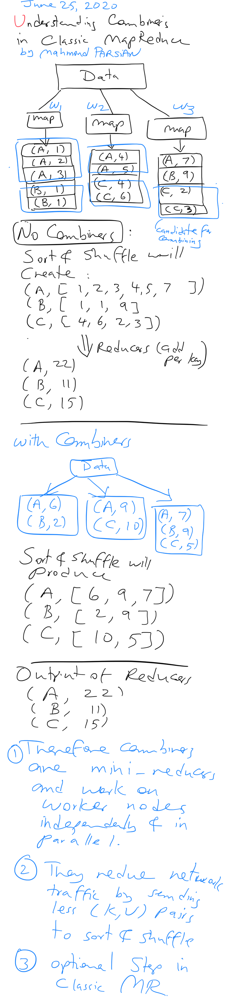

# MapReduce with Combiners

	Author: Mahmoud Parsian
	Created: 10/03/2024
	Last updated: 8/18/2026

The purpose of this directory is to explain the MapReduce
programming model — mapper, reducer, and the optional
**combiner** — and to walk through several worked examples
comparing a MapReduce job with and without a combiner.

MapReduce is a programming model and an associated
implementation for processing and generating big data sets
with a parallel, distributed algorithm on a cluster.

## In This Directory

| File | Contents |
|---|---|
| `README.md` (this file) | Core concepts: mapper, reducer, combiner, and why a combiner is safe (or not) to use |
| [`Word_Count_in_MapReduce.md`](./Word_Count_in_MapReduce.md) | Worked example: word count, solved with and without a combiner, including a partition-by-partition walkthrough and a Q&A/homework section |
| [`MapReduce_with_Combiners.md`](./MapReduce_with_Combiners.md) | Two more worked examples: average value per gene, and `(avg, min, max)` per gene — each solved with and without a combiner |
| [`images/`](./images/) | Diagrams used by the files above |

## MapReduce with Mappers and Reducers

## MapReduce with Mappers, Combiners, and Reducers

## MapReduce Functions

MapReduce has 3 functions:

1. A Mapper: `map(K, V)`

2. A Combiner: `combine(K, V)` [OPTIONAL] — a mini-reducer
   that runs locally on a single mapper's output

3. A Reducer: `reduce(K, V)`

## Mapper

In MapReduce, a mapper is a task that transforms
input records into intermediate key-value pairs.
The mapper's output is then passed (via shuffle and
sort) to a reducer, which aggregates the intermediate
key-value pairs into a smaller set of key-value pairs
as the final output.

A mapper can emit any number (0, 1, 2, 3, ...)
of (K, V) pairs as output.

~~~text
map(key, value):
 (K1, V1)
 (K2, V2)
 (K3, V3)
 ...
~~~

## Reducer

In MapReduce, a reducer is a function that takes
in a set of (key, values) pairs as input and produces
a smaller, more meaningful set of (key, value) pairs
as output. The reducer is one of the two core functions
of MapReduce, the other being the map function.

A reducer can emit any number (0, 1, 2, 3, ...)
of (K, V) pairs as output.

~~~text
reduce(key, values):
 (Key1, Value1)
 (Key2, Value2)
 (Key3, Value3)
 ...
~~~

## Combiner

In the MapReduce framework, a combiner is an
optional step that reduces the amount of data
transferred across the network during the Shuffle
and Sort phase. It's similar to a reducer, but
it operates locally — on the output of a single
mapper — *before* that data is shuffled to reducers.

A combiner can emit any number (0, 1, 2, 3, ...)
of (K, V) pairs as output.

~~~text
combine(key, values):
 (Key1, Value1)
 (Key2, Value2)
 (Key3, Value3)
 ...
~~~

**When is it safe to use a combiner?** Only when the
reduce function is **associative and commutative** — the
framework may invoke the combiner zero, one, or many
times per key, in any order, so the result must not
depend on how the inputs happen to be grouped. `sum`,
`min`, `max`, and `count` all have this property; a plain
`average` does not (you can't average partial averages
without also tracking the counts behind them — see the
gene-average example for how to fix that with a
`(sum, count)` pair).

A combiner is also an **optimization, never a
guarantee** — Hadoop/Spark may skip running it entirely,
so the reducer must still be correct on its own.

A worked numeric example, showing that the "no combiner" and
"with combiner" paths land on the exact same final answer
(`A=22, B=11, C=15` either way):

## Worked Examples

* **Word count** — the classic MapReduce example, solved
  with and without a combiner, including a
  partition-by-partition trace showing exactly how many
  records the combiner saves from crossing the network:
  see [`Word_Count_in_MapReduce.md`](./Word_Count_in_MapReduce.md).

* **Average per gene**, and **`(avg, min, max)` per
  gene** — two more examples where the naive combiner
  (just averaging, or just min/max-ing) would be wrong,
  and the fix is to emit a small aggregate tuple
  (`(sum, count)`, then `(sum, count, min, max)`) that
  *is* associative and commutative:
  see [`MapReduce_with_Combiners.md`](./MapReduce_with_Combiners.md).

## References

1. [MapReduce – Combiners](https://www.geeksforgeeks.org/mapreduce-combiners/)

2. [MapReduce - Combiners](https://www.tutorialspoint.com/map_reduce/map_reduce_combiners.htm)

3. [Best Explanation to MapReduce Combiner](https://data-flair.training/blogs/hadoop-combiner-tutorial/)

4. [MapReduce From Wikipedia](https://en.wikipedia.org/wiki/MapReduce)

5. [MapReduce Combiners](https://www.tutorialscampus.com/tutorials/map-reduce/combiners.htm)

6. [Mapreduce Combiner Example](https://examples.javacodegeeks.com/enterprise-java/apache-hadoop/hadoop-mapreduce-combiner-example/)

7. [Combiner in Mapreduce](http://hadooptutorial.info/combiner-in-mapreduce/)
