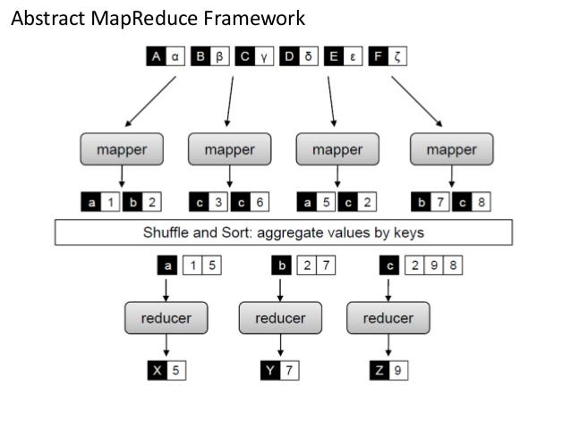

# General MapReduce Paradigm

	Author: Mahmoud Parsian
	Last updated: 8/18/2026

The purpose of this document is to provide a
MapReduce example — word count — solved both
with and without a combiner, so the effect of
the combiner is visible side by side.

MapReduce is a programming model and an
associated implementation for processing
and generating big data sets with a parallel,
distributed algorithm on a cluster.

## Table of Contents

1. MapReduce functions: map, combine, reduce
2. Word count problem statement
3. Solution **without** a combiner
4. Solution **with** a combiner
5. Questions, answers, and homework

## MapReduce with Mappers and Reducers

## MapReduce with Mappers, Combiners, and Reducers

## MapReduce Functions

MapReduce has 3 functions:

1. A Mapper: `map(K, V)`

2. A Combiner: `combine(K, V)` [OPTIONAL] — a mini-reducer
   that runs locally on a single mapper's output

3. A Reducer: `reduce(K, V)`

## Mapper

In MapReduce, a mapper is a task that transforms
input records into intermediate key-value pairs.
The mapper's output is then passed (via shuffle
and sort) to a reducer, which aggregates the
intermediate key-value pairs into a smaller set
of key-value pairs as the final output.

A mapper can emit any number (0, 1, 2, 3, ...)
of (K, V) pairs as output.

~~~text
map(key, value):
 (K1, V1)
 (K2, V2)
 (K3, V3)
 ...
~~~

## Reducer

In MapReduce, a reducer is a function that takes
in a set of (key, values) pairs as input and produces
a smaller, more meaningful set of (key, value) pairs
as output. The reducer is one of the two core functions
of MapReduce, the other being the map function.

A reducer can emit any number (0, 1, 2, 3, ...)
of (K, V) pairs as output.

~~~text
reduce(key, values):
 (Key1, Value1)
 (Key2, Value2)
 (Key3, Value3)
 ...
~~~

## Combiner

In the MapReduce framework, a combiner is an
optional step that reduces the amount of data
transferred across the network during the Shuffle
and Sort phase. It's similar to a reducer, but
it operates locally — on the output of a single
mapper — *before* that data is shuffled to reducers.

A combiner can emit any number (0, 1, 2, 3, ...)
of (K, V) pairs as output.

~~~text
combine(key, values):
 (Key1, Value1)
 (Key2, Value2)
 (Key3, Value3)
 ...
~~~

**Why is it safe to use a combiner for word count?**
Because addition is both **associative** and
**commutative**: `sum([1,1,1,1,1]) == sum([1,1]) + sum([1,1,1])`.
Pre-summing a subset of the values on the mapper side
and re-summing those partial sums on the reducer side
gives the exact same final total. Not every reducer has
this property (e.g., `average` does *not*, since you
can't average partial averages without also tracking
counts) — that's why a combiner is optional, and only
correct when the reduce function is associative and
commutative.

## Example: Word Count in MapReduce

**Problem Statement**: Given a set of text
documents, where a document can have
hundreds, thousands, or millions of records,
find the frequency of each unique word.

Given the following 3 documents: `doc1`, `doc2`, `doc3`

~~~text
$ cat doc1
fox jumped and jumped
fox jumped high

$ cat doc2
fox jumped high
fox jumped
fox is red

$ cat doc3
fox is red
~~~

Then the MapReduce output should be:

~~~text
(fox, 6)
(jumped, 5)
(and, 1)
(high, 2)
(is, 2)
(red, 2)
~~~

# MapReduce Solution Without a Combiner

## Mapper

Assume the key is a record number and value
is the actual record passed to a mapper:

~~~text
# key: record number, ignored
# value: an actual record
map(key, value) {
   # tokenize the input record
   # assume that words are separated by a space " "
   words = value.split(" ")

   # iterate words and emit (word, 1) for each word
   for word in words {
       emit(word, 1)
   }
}
~~~

## Output of Mappers

~~~text
for the first record of doc1:
map(key=1, value="fox jumped and jumped"):
(fox, 1)
(jumped, 1)
(and, 1)
(jumped, 1)

for the second record of doc1:
map(key=2, value="fox jumped high"):
(fox, 1)
(jumped, 1)
(high, 1)

for the first record of doc2:
map(key=1, value="fox jumped high"):
(fox, 1)
(jumped, 1)
(high, 1)

for the second record of doc2:
map(key=2, value="fox jumped"):
(fox, 1)
(jumped, 1)

for the third record of doc2:
map(key=3, value="fox is red"):
(fox, 1)
(is, 1)
(red, 1)

for the first record of doc3:
map(key=1, value="fox is red"):
(fox, 1)
(is, 1)
(red, 1)
~~~

# Input to Sort & Shuffle

Without a combiner, **every** mapper output record
(15 records total) is shipped across the network
as-is:

~~~text
(fox, 1)
(jumped, 1)
(and, 1)
(jumped, 1)

(fox, 1)
(jumped, 1)
(high, 1)

(fox, 1)
(jumped, 1)
(high, 1)

(fox, 1)
(jumped, 1)

(fox, 1)
(is, 1)
(red, 1)

(fox, 1)
(is, 1)
(red, 1)
~~~

# Output of Sort & Shuffle

~~~text
(fox,    [1, 1, 1, 1, 1, 1])
(jumped, [1, 1, 1, 1, 1])
(and,    [1])
(high,   [1, 1])
(is,     [1, 1])
(red,    [1, 1])
~~~

## Reducer: LONGER VERSION

~~~text
# key: unique word
# values: Iterable<Integer>
reduce(key, values) {
   total = 0
   for v in values {
     total += v
   }

   # emit frequency for the unique word
   emit(key, total)
}
~~~

## Reducer: SHORTER VERSION

~~~text
# key: unique word
# values: Iterable<Integer>
reduce(key, values) {
   total = sum(values)

   # emit frequency for the unique word
   emit(key, total)
}
~~~

# Output of Reducers

~~~text
(fox, 6)
(jumped, 5)
(and, 1)
(high, 2)
(is, 2)
(red, 2)
~~~

# MapReduce Solution With a Combiner

## Mapper

The mapper is unchanged — the combiner is inserted
into the pipeline *after* the mapper and *before*
the shuffle, so `map()` itself doesn't need to know
a combiner exists:

~~~text
# key: record number, ignored
# value: an actual record
map(key, value) {
   # tokenize the input record
   words = value.split(" ")

   # iterate words and emit (word, 1) for each word
   for word in words {
       emit(word, 1)
   }
}
~~~

Output of Mappers with Partitions:
Assume that we have 3 partitions, one combiner
runs per partition, and each combiner only ever
sees the records produced *within its own partition*.

Partition-1: (both records of `doc1`)

~~~text
mappers output  ---> combiner             combiner
==============       INPUT:               OUTPUT:
(fox, 1)            (fox, [1, 1])         (fox, 2)
(jumped, 1)         (jumped, [1, 1, 1])   (jumped, 3)
(and, 1)            (and, [1])            (and, 1)
(jumped, 1)         (high, [1])           (high, 1)

(fox, 1)
(jumped, 1)
(high, 1)
~~~

Partition-2: (first two records of `doc2`)

~~~text
mappers output  ---> combiner             combiner
==============       INPUT:               OUTPUT:
(fox, 1)            (fox, [1, 1])         (fox, 2)
(jumped, 1)         (jumped, [1, 1])      (jumped, 2)
(high, 1)           (high, [1])           (high, 1)

(fox, 1)
(jumped, 1)
~~~

Partition-3: (third record of `doc2` + the record of `doc3`)

~~~text
mappers output  ---> combiner             combiner
==============       INPUT:               OUTPUT:
(fox, 1)            (fox, [1, 1])         (fox, 2)
(is, 1)             (is, [1, 1])          (is, 2)
(red, 1)            (red, [1, 1])         (red, 2)

(fox, 1)
(is, 1)
(red, 1)
~~~

## Combiner

~~~text
# key: word
# values: Iterable<Integer>
combine(key, values) {
   total = sum(values)
   emit(key, total)
}
~~~

Notice `combine()` and `reduce()` are *identical*
here — that's typical for associative/commutative
aggregations like sum, min, max, and count.

## Input to final Sort & Shuffle

After combining, only **10** records cross the
network instead of the original 15 — a ~33% cut
for this tiny example, and the savings grow with
the amount of repetition in the data:

~~~text
(fox, 2)
(jumped, 3)
(and, 1)
(high, 1)

(fox, 2)
(jumped, 2)
(high, 1)

(fox, 2)
(is, 2)
(red, 2)
~~~

## Output of final Sort & Shuffle

~~~text
(fox,    [2, 2, 2])
(jumped, [3, 2])
(and,    [1])
(high,   [1, 1])
(is,     [2])
(red,    [2])
~~~

## Reducer

~~~text
# key: word
# values: Iterable<Integer>
reduce(key, values) {
   total = sum(values)
   emit(key, total)
}
~~~

Final Output of Reducers:

~~~text
(fox, 6)
(jumped, 5)
(and, 1)
(high, 2)
(is, 2)
(red, 2)
~~~

Same final answer as the no-combiner run above —
the combiner only changed *how much data moved*,
never *what the answer was*.

# Some Questions and Answers

## Question-1

Apply a filter to your MapReduce solution
so that if any word appears fewer than 4 times,
then ignore it.

## Solution-1: apply the filter in the reducer

This filter depends on the **global** total for a
word, and only the reducer ever sees that total —
a combiner only sees a partial, per-partition sum,
so filtering in the combiner would be wrong (e.g.,
`jumped` totals 3 in partition-1 alone, which is
`< 4`, but the true global total is 5).

Revised Reducer:

~~~text
# key: word
# values: Iterable<Integer>
reduce(key, values) {
   total = sum(values)
   if (total < 4) {
      return
   }
   else {
     emit(key, total)
   }
}
~~~

Final Output of Revised Reducer:

~~~text
(fox, 6)
(jumped, 5)
~~~

## Question-2

Ignore any word that is fewer than
3 characters long, such as "a", "of", "is", ...

## Solution-2: apply the filter in the mapper

This filter only needs the word itself — no
aggregate information — so it can be decided
locally, as early as possible, in the mapper.

Revised Mapper:

~~~text
# key: record number, ignored
# value: an actual record
map(key, value) {
   # tokenize the input record
   words = value.split(" ")

   # iterate words and emit (word, 1) for each word
   for word in words {
       if (len(word) > 2) {
          emit(word, 1)
       }
   }
}
~~~

## Question-3: Homework

Given input records of `gene_id` and a value:

~~~text
g1,3
g1,2
g1,5
g2,3
g2,1
...
~~~

1. Find a MapReduce solution to compute the average
   per `gene_id` using `map()` and `reduce()`.

2. Find a MapReduce solution to compute the average
   per `gene_id` using `map()`, `combine()`, and
   `reduce()`.

   **Hint:** a plain `average` combiner is *not*
   correct (averaging partial averages is not the
   same as the true average unless every partition
   has the same count). Emit `(sum, count)` pairs
   from the mapper/combiner instead of raw values,
   combine them by summing both components, and only
   divide `sum / count` in the final reducer.

# References

1. [MapReduce – Combiners](https://www.geeksforgeeks.org/mapreduce-combiners/)

2. [MapReduce - Combiners](https://www.tutorialspoint.com/map_reduce/map_reduce_combiners.htm)

3. [Best Explanation to MapReduce Combiner](
https://data-flair.training/blogs/hadoop-combiner-tutorial/)

4. [MapReduce From Wikipedia](
https://en.wikipedia.org/wiki/MapReduce)
