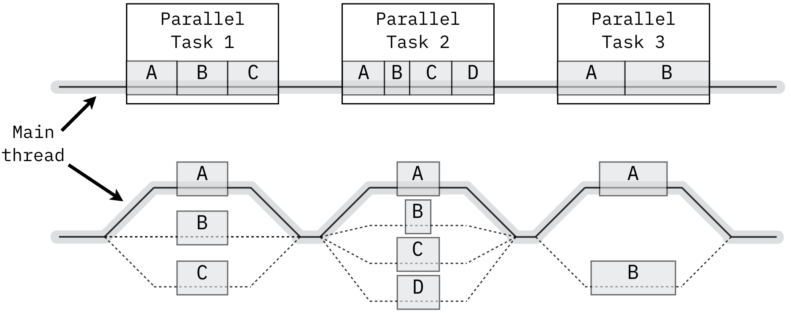
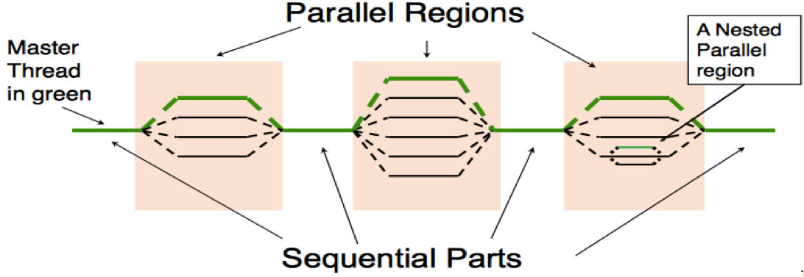

<!-- _class: lead -->

# Understanding Parallelism & Concurrency
### (informal introduction)

Mahmoud Parsian
Ph.D. in Computer Science

---

## Why Parallelism?

Parallelism and partitioning are foundations of big data solutions:

- MapReduce is based on parallelism and partitioning data
- Hadoop is based on parallelism and partitioning data
- Spark is based on parallelism and partitioning data
- Snowflake is based on parallelism and partitioning data

---

## How to Solve Big Data Problems

* Parallel computing divides a large problem 
  into smaller ones, 

* Each smaller problem/data carried out 
  independently by its own processor.

---

## Parallelism Example: Array Addition

* Sequential Solution

```python
for (i = 0; i < n; i++) {
    c[i] = a[i] + b[i];
}
```

---

## Parallelism Example: Array Addition

* Parallel Solution: by `n` parallel tasks

```python
c[0] = a[0] + b[0];       # parallel task
c[1] = a[1] + b[1];       # parallel task
...
c[n-1] = a[n-1] + b[n-1]; # parallel task
```

---

## Parallelism Example: Array Addition


| | Steps | Processors |
|---|---|---|
| **Sequential** | `n` steps | 1 processor |
| **Parallel** | 1 step | `n` processors |

---

## Concurrency & Parallelism (informal definitions)

- The fact of two or more events or circumstances happening or
  existing at the same time.
- The ability to execute more than one program or task
  simultaneously.

> "A high level of concurrency is crucial to good performance in a
> multiuser database system" — e.g. multiple reads at a time,
> multiple writes at a time.

---

## Fork/Join: Threads Splitting Into Parallel Tasks



---

## Concurrency vs. Parallelism: A Worked Comparison

```
Task A = {A1,A2,A3,A4}
Task B = {B1,B2,B3}
Task C = {C1,C2}
```

**Sequential** (9 steps, one at a time):

```text
A1, A2, A3, A4, B1, B2, B3, C1, C2
```

Assume Tasks A, B, C are independent of each other — 

what changes if we run them concurrently instead?

---

## Concurrency vs. Parallelism: Running Concurrently

**Concurrent** (4 steps — as many tasks running at once as are left):

| Step | Running concurrently |
|---|---|
| 1 | A1, B1, C1 (3 tasks) |
| 2 | A2, B2, C2 (3 tasks) |
| 3 | A3, B3 (2 tasks) |
| 4 | A4 (1 task) |

9 sequential steps become 4 — bounded by the *longest* task (A, with
4 sub-steps), not the sum of all of them.

---

## Maximum Parallelism

If there is **no dependency at all** between any of the 9 individual
tasks, run all of them concurrently, in a single step:

```text
A1, A2, A3, A4, B1, B2, B3, C1, C2
```

(vs. 9 sequential steps, or 4 steps in the "respect each task's own
internal order" scenario on the previous slide)

---

## Parallelism Improves Execution Time

| | Sequential | Parallel |
|---|---|---|
| Task-1 | 20 min | run together |
| Task-2 | 20 min | (no dependencies |
| Task-3 | 25 min | between tasks) |
| Task-4 | 25 min | |
| **Total** | **90 minutes** | **25 minutes** |

---

## Dependencies Can Be Bottlenecks

What if `{Task-3, Task-4}` depend on the output of `{Task-1, Task-2}`?

| | Sequential | Parallel |
|---|---|---|
| Iteration-1 | Task-1 (20 min) | Task-1, Task-2 (20 min) |
| Iteration-2 | Task-2 (20 min) | Task-3, Task-4 (25 min) |
| Iteration-3 | Task-3 (25 min) | |
| Iteration-4 | Task-4 (25 min) | |
| **Total** | **90 minutes** | **45 minutes** |

Tasks within each pair are independent, but the second pair can't
start until the first pair finishes.

---

## Parallel Regions and Sequential Parts



A program alternates between purely sequential sections (the master
thread alone) and parallel regions (work forked out and joined back).

---

<!-- _class: lead -->

## The Birthday Party Example

Alex is throwing a big birthday party and has a list of **1000 items** to buy from the grocery store. 

How long does shopping take —
and how does adding more shoppers change the answer?

---

## Shopping Alone: No Parallelism Yet

One executor (Alex), working through the list in sequence:

item-1, item-2, ..., item-1000.

It takes about **14 seconds per item** to find it and put it in the cart:

```text
1000 items x 14 seconds = 14,000 seconds = 233 minutes
```

Alex is busy and can't spend 233 minutes shopping. 

What to do?

---

## Scaling Out: More Executors, Less Time

Alex recruits friends; each friend (an **executor**) buys an equal
share of the list, in parallel, and delivers to Alex:

| Executors | Items per executor | Total elapsed time |
|---|---|---|
| 1 (Alex alone) | 1000 | 233 minutes |
| 10 friends | 100 | 23 minutes |
| 100 friends | 10 | ~2 minutes |
| 1000 friends | 1 | **14 seconds** |

Same 14-second-per-item cost throughout — only the number of
executors working *concurrently* changes. More executors, less
elapsed time. Alex is finally satisfied at 1000 executors.

---

## How Do We Write Parallel Programs?

- **Task parallelism** — partition the various *tasks* involved in
  solving the problem among the cores.
- **Data parallelism** — partition the *data* used in solving the
  problem among the cores; each core carries out similar operations
  on its part of the data.

---

## Data Parallelism: Partitioning at Scale

Suppose your data has **200,000,000,000** data points, partitioned
into 100,000 chunks of 2,000,000 records each.

To run `map(function)` over every record, the fastest approach is
100,000 mappers running in parallel — one per chunk.

**What if you only have 1000 mappers?**

---

## Data Parallelism: Iterating Over Partitions

With only 1000 mappers and 100,000 partitions:

1. Assign 1000 partitions to the 1000 mappers (one partition each,
   2,000,000 records per partition).
2. As each mapper finishes, assign it another partition.
3. Repeat until all 100,000 partitions are processed.

At most 1000 mappers run at any single point in time. 

**The more mappers you have, the faster you execute.**

---

## Parallelism Requires Coordination

Executors usually need to coordinate their work:

- **Communication** — executors send partial results to each other.
- **Load balancing** — share work evenly so no executor is overloaded.
- **Synchronization** — make sure no executor gets too far ahead of
  the rest.

> If you use Spark or MapReduce, all of this is handled for you
> automatically.

*This slide's content is drawn from a third-party parallel-computing
textbook (© 2010, Elsevier Inc., per the source deck), not original
material.*

---

## Partitioner: Partitioning Data Into Chunks

A partitioner splits the input into chunks. E.g. 200,000,000,000
records partitioned into 200,000 chunks of 1,000,000 records each:

```text
200,000,000,000 = 200,000 partitions x 1,000,000 records
```

Typically, one chunk becomes the unit of parallelism:
**Chunk = Partition**.

---

## The Limit of Parallelism: Amdahl's Law

Not everything can be parallelized — most real programs have some
**serial** portion (setup, I/O, merging results) that no amount of
extra processors can speed up. If `S` is that serial fraction, the
maximum possible speedup with `N` processors is:

```text
Speedup(N) = 1 / (S + (1 - S) / N)
```

As `N -> infinity`, `Speedup -> 1/S` — a **hard ceiling**, no matter
how many machines you throw at it.

---

## Amdahl's Law, With Numbers

Just **10% serial** (`S = 0.1`) already caps you at 10x, forever:

| Processors (`N`) | Speedup |
|---|---|
| 1 | 1.00x |
| 2 | 1.82x |
| 4 | 3.08x |
| 10 | 5.26x |
| 100 | 9.17x |
| ∞ | **10.00x (ceiling)** |

---

## Amdahl's Law: The Takeaway

Going from 10 to 100 processors barely moves the needle. This is
*why* the "Dependencies Can Be Bottlenecks" slide earlier mattered —
minimizing the serial fraction matters more than adding hardware.

---

## Benefits of Parallel Computing

- Models the real world — the world isn't serial/sequential; many
  things happen at the same time.
- **Saves time** — sequential computing forces fast processors to work
  inefficiently.
- **Saves money** — saving time makes things cheaper and faster.
- Solves larger, more complex problems by partitioning them into
  smaller ones.
- Leverages all available resources.

---

## References

1. [Introduction to Parallel Computing](https://www.geeksforgeeks.org/introduction-to-parallel-computing/) — GeeksforGeeks
2. [Introduction: Parallelism = Opportunities + Challenges](https://courses.cs.washington.edu/courses/csep524/07sp/poppChaper1.pdf) — CSEP 524, University of Washington
