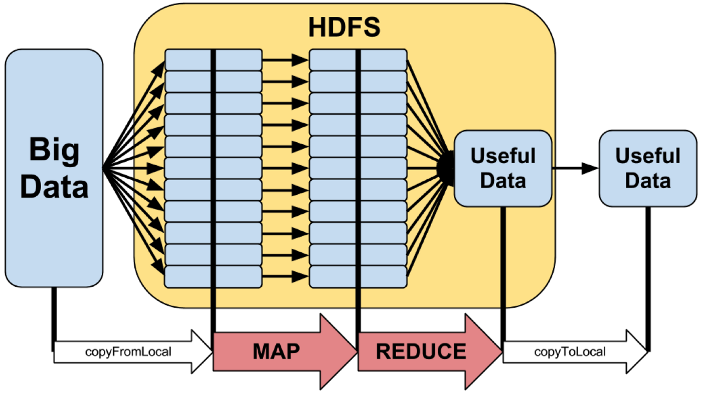
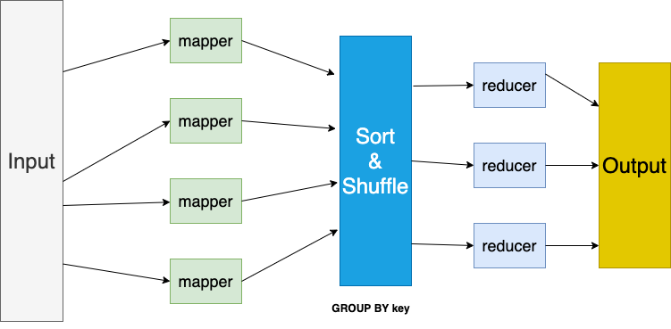
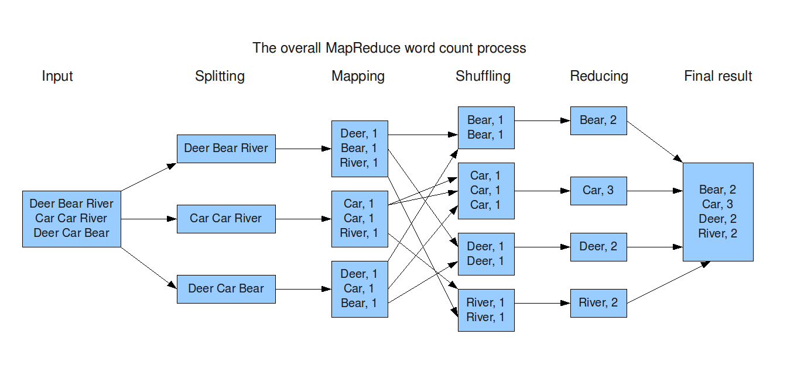

<!-- _class: lead -->

# Introduction to MapReduce

Mahmoud Parsian
Ph.D. in Computer Science

---

## What Is MapReduce?

- A **programming model** or abstraction — **not** a programming language.
- A novel way of thinking about designing a solution to certain big
  data problems.
- It enables you to:
  1. Partition data into small chunks (**partitions**)
  2. Execute tasks in parallel via **Mappers** and **Reducers**

---

## Why MapReduce?

- We have access to huge volumes of data — Google processed ~24
  petabytes/day in 2009; Facebook, ~60 petabytes/day in 2020.
- A single machine can't serve all of it — you need a distributed
  system (**cluster computing**) to store and process it in parallel.
- But parallel programming is hard: concurrency/threading, inter-node
  communication, scaling to more machines, machine/disk failures...

**MapReduce uses cluster computing to make parallelism tractable.**

---

## A Pipe Dream, and Why It Almost Works

- Computational resources are cheap and easy to get (Amazon EC2,
  Microsoft Azure, ...) — so why isn't parallel programming easy too?
- Code running on one CPU is simple; on two, a headache; on four, a
  nightmare.
- The pipe dream: write code imagining a single CPU, and let someone
  else run it across thousands of machines — freeing the programmer
  from the distributed-systems details.
- **MapReduce is what makes that pipe dream mostly true.**

---

## A Brief History: LISP (1958)

`map()` and `reduce()` aren't MapReduce inventions — they're
functional-programming primitives from **LISP** (John McCarthy, MIT,
1960: *"Recursive Functions of Symbolic Expression and Their
Computation by Machine"*):

```text
map(mf, [a1, a2, ..., an])    -> [b1, b2, ..., bn]

reduce(rf, [b1, b2, ..., bn]) -> c
```

`map()` applies a function to every element of a list; 

`reduce()` combines a list of values into one, using another function. 

`map()`'s output (a list) composes directly into `reduce()`'s input.

---

## The Analogy

1. Break a large problem into small pieces.
2. Write `mf` to solve *one* piece.
3. Run `map()` to apply `mf` to every piece, in parallel — producing
   nuggets of partial solutions.
4. Write `rf` to combine the nuggets.
5. Run `reduce()` to apply `rf` and produce the complete solution.

**Example:** a 1TB file, split into 100,000 chunks — `mf` counts
lines in one chunk, `rf` adds the counts together into a final total.

---

## MapReduce, Reintroduced

- **Google** created the awareness by publishing a paper:
  *"MapReduce: Simplified Data Processing on Large Clusters"* —
  Jeffrey Dean & Sanjay Ghemawat, OSDI'04 (Dec. 2004).
- **Apache Hadoop** made it a sensation — an open-source MapReduce
  implementation based on Google's paper.
- **Apache Spark** implements a superset of MapReduce (in-memory,
  much faster).

Google's original problem: indexing billions of web documents a day
— solved by running MapReduce across 100s or 1000s of commodity
servers.

---

## MapReduce: Model vs. Implementation


---

## Model vs. Implementation, Applied to MapReduce

A piano *keyboard architecture* defines the standard layout; a grand
piano, an upright, and a digital keyboard are different
*implementations* of it.

Likewise, MapReduce is a **model**; 

Google App Engine, Apache Hadoop,
Apache Spark, Apache Tez, Snowflake, and Amazon Athena are different
**implementations** of that same model.

---

## Big Data, Through the MapReduce Funnel



---

# Notation used: 

#### `()` = tuple 
#### `[]` = list  
#### `{}` = set 
#### `Iterable<T>` = a list of `T`-typed objects.

---

## The Universal Interface: `(key, value)`

Every MapReduce input and output is a `(key, value)` tuple — key and
value can be any data type.

```text
Mapper:  map(key, value)      -> {(k2, v2), ...}

Reducer: reduce(key2, value2) -> {(k3, v3), ...}
  # key2 is one of the mapper's k2's
  # value2 is Iterable<objects> (or a list of objects) 
  # for that key2
```

---

## The MapReduce Pipeline



---

## The MapReduce Pipeline, Explained

- `map(key, value)` runs on every record and can emit any number of
  `(K, V)` pairs.
- **Sort & Shuffle** (provided by the MapReduce implementation)
  groups mapper output by key — SQL's `GROUP BY`.
- `reduce(key, values)` then runs once per unique key.

---

## Worked Example: Word Count, Start to Finish



Three input lines → split → each mapper tokenizes its own line into
`(word, 1)` pairs → shuffle groups by word → each reducer sums one
word's counts → final result.

---

## The Same Example, Traced Step by Step

Input: `"fox jumped and fox jumped and jumped and jumped"`

**Mapper output:**

```text
(fox,1) (jumped,1) (and,1) 
(fox,1) (jumped,1) (and,1) 
(jumped,1) (and,1) (jumped,1)
```

**Sort & Shuffle output** (grouped by key):

```text
(fox, [1,1])   
(jumped, [1,1,1,1])   
(and, [1,1,1])
```

**Reducer output:**
`(fox, 2)   (jumped, 4)   (and, 3)`

---

## Mappers and Reducers Run in Parallel

- `map()` runs in parallel — each mapper operates on the chunks
  assigned to it, and writes its output to local disk.
- `reduce()` runs in parallel — each reducer operates on one
  `(key, [V1, ..., Vn])` group and emits `(K, T)` results.
- Both are typically **single-threaded and deterministic** — no
  multithreaded code to write, and determinism lets failed tasks
  simply be **re-run** (mappers are idempotent).
- Need to handle more data? Add more mappers/reducers — they run
  entirely independently, in separate processes.

---

## Routing Mapper Output to Reducers

The number of reducers `n` is known ahead of time, and the number of
partitions equals `n`. Each mapper's output key is routed to a
reducer by hashing:

```text
partition = hash(key) mod n
```

This also gives **load balancing by randomization** — keys spread
roughly evenly across reducers, assuming a reasonable hash function.

---

## Routing, With Numbers

With `n = 3` reducers, and a hash function that (for these words)
happens to produce:

| Key | `hash(key)` | `hash(key) mod 3` | Reducer |
|---|---|---|---|
| `"fox"` | 17 | 2 | Reducer 2 |
| `"jumped"` | 42 | 0 | Reducer 0 |
| `"and"` | 8 | 2 | Reducer 2 |

`"fox"` and `"and"` both land on Reducer 2 — a **collision**, not a
bug. With only 3 keys, a small imbalance like this is normal; with
the millions of keys a real job has, the same hashing evens out
across reducers on average.

---

## Synchronization: The Map/Reduce Barrier

Reducers **cannot start** until *all* mappers have completed — a
synchronization barrier sits between the map and reduce phases.
(Why? A reducer needs the *complete* set of values for its key before
it can produce a correct result — an early value could still be
missing from a mapper that hasn't finished yet.)

---

## Failure Is the Norm, Not the Exception

Failures are expected on commodity hardware:

- **Worker failure** — detected via periodic heartbeats; in-progress
  map/reduce tasks are simply re-executed elsewhere.
- **Master failure** — a single point of failure; resumes from an
  execution log.

Google's own experience: lost 1600 of 1800 machines on one run —
**and the job still finished successfully.**

---

## MapReduce Job Components

1. **Input path** — where to read from
2. **Output path** — where reducer output is written
3. **`map()`** function — emits `{(K2, V2), ...}`
   *(Sort & Shuffle happens automatically in between)*
4. **`reduce()`** function — emits `{(K3, V3), ...}`
5. Optional **`combine()`** function

Example paths: `s3://my_bucket/project7/*.txt` (input) →
`s3://my_bucket/output7/{_SUCCESS, part1, part2, ...}` (output).

---

## `map()` in Practice, With a Filter

```python
def map(key, value):
    words = value.split(" ")
    for word in words:
        # filter: drop words < 3 chars
        if len(word) > 2: 
            emit(word, 1)
```

Input `(103, "a fox of jumped over red fox and jumped")` → output
drops `"a"` and `"of"` (too short) and emits the rest as `(word, 1)`.

Filtering can happen in the mapper *or* the reducer, with different
trade-offs — that's the whole subject of
[`05_filters_in_mapreduce.md`](05_filters_in_mapreduce.md).

---

## `reduce()` in Practice

```python
def reduce(key, values):
    count = 0
    for v in values:
        count += v
    emit(key, count)
```

Input `(store, [1, 1, 1, 1])` → output `(store, 4)`. Same idea as the
mapper's filter: a reducer can also filter — e.g. only emit words
with `count >= 5` — again, see
[`05_filters_in_mapreduce.md`](05_filters_in_mapreduce.md) for the
full trade-off discussion.

---

## What MapReduce Gives You

- Partitioning data into small chunks
- Automatic parallelization and distribution
- I/O scheduling
- Load balancing
- Network and data-transfer optimization
- **Fault tolerance** — continuing to operate without interruption
  when a component (disk, machine, ...) fails

---

## Scale-Out, Not Scale-Up

- **Scale-out**: large numbers of commodity servers — cheap to add or
  replace, can grow any time.
- **Scale-up** (avoided): expensive, high-end specialized servers —
  costly to buy *and* to replace.

A commodity server is treated as **disposable**: when it fails, it's
replaced, not repaired — many low-end servers share the workload
instead of relying on one powerful, fragile one.

---

## Not a Panacea

If your workload exhibits **embarrassing parallelism** — pieces that
are naturally independent of each other — Hadoop/MapReduce may be the
ideal framework.

**If not**, look for other parallel programming paradigms; forcing a
non-embarrassingly-parallel problem into MapReduce's shape can cost
more than it saves.

---

## Reference: Classic Hadoop Word Count (Legacy API)

We will **not** study Hadoop itself in this course — its API has a
lot of moving parts. For reference only, the classic (pre-2.0) Hadoop
`Mapper`/`Reducer` classes for Word Count:

```java
public void map(LongWritable key, 
                Text value, 
                OutputCollector<Text, IntWritable> output,
                Reporter reporter) throws IOException {
    StringTokenizer itr = new StringTokenizer(value.toString());
    while (itr.hasMoreTokens()) {
        output.collect(new Text(itr.nextToken()), 
                       new IntWritable(1));
    }
}

public void reduce(Text key, 
                   Iterator<IntWritable> values, 
                   OutputCollector<Text, IntWritable> output,
                   Reporter reporter) throws IOException {
    int sum = 0;
    while (values.hasNext()) { 
       sum += values.next().get(); 
    }
    output.collect(key, new IntWritable(sum));
}
```

Source: [Yahoo! Hadoop Tutorial, Module 4](https://developer.yahoo.com/hadoop/tutorial/module4.html)

---

## Try It Yourself

Using the Word Count `map()`/`reduce()` from this deck, work through:

```text
Input: "the cat sat" , "the dog sat"
```

What are the mapper outputs, the Sort & Shuffle output, and the
final reducer output? (Answer on the next slide.)

---

## Try It Yourself: Answer

```text
Mapper output:   (the,1) (cat,1) (sat,1) (the,1) (dog,1) (sat,1)
Sort & Shuffle:  (the,[1,1]) (cat,[1]) (sat,[1,1]) (dog,[1])
Reducer output:  (the,2) (cat,1) (sat,2) (dog,1)
```

Same `split()` + count-in-a-dictionary idea as
[`03_word_count_in_python.md`](03_word_count_in_python.md) — just
partitioned across two input records instead of run as one loop.

---

## Summary

MapReduce is a programming paradigm for **data-intensive computing**
— a distributed, parallel execution model that's simple to program
against. The framework automates the tedious parts:

- Data partitioning
- Machine selection
- Failure handling
- Sort & Shuffle

---

<!-- _class: lead -->

## Next

- Full worked walkthroughs (Word Count, Sales Revenue by Region):
  [`introduction_to_mapreduce/02_MapReduce_Examples.md`](../introduction_to_mapreduce/02_MapReduce_Examples.md)
- Word Count as a complete MapReduce job:
  [`04_word_count_in_mapreduce.md`](04_word_count_in_mapreduce.md)
- Filtering, mapper-side vs. reducer-side:
  [`05_filters_in_mapreduce.md`](05_filters_in_mapreduce.md)

**References:** Dean & Ghemawat, *MapReduce: Simplified Data
Processing on Large Clusters* (OSDI'04); Jimmy Lin's book on
MapReduce; McCarthy, *Recursive Functions of Symbolic Expression*
(1960).
