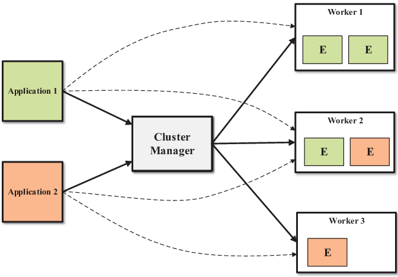
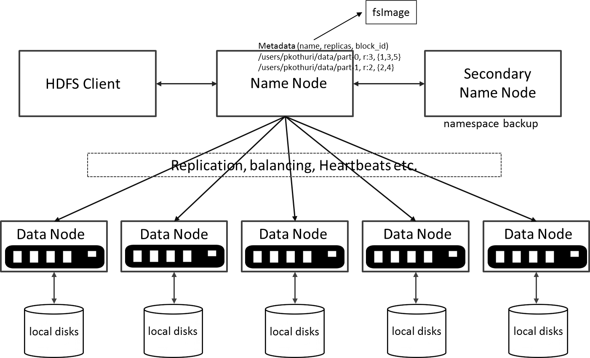
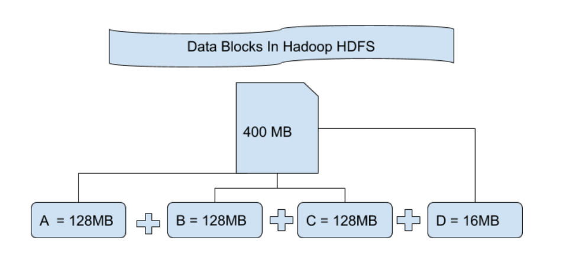
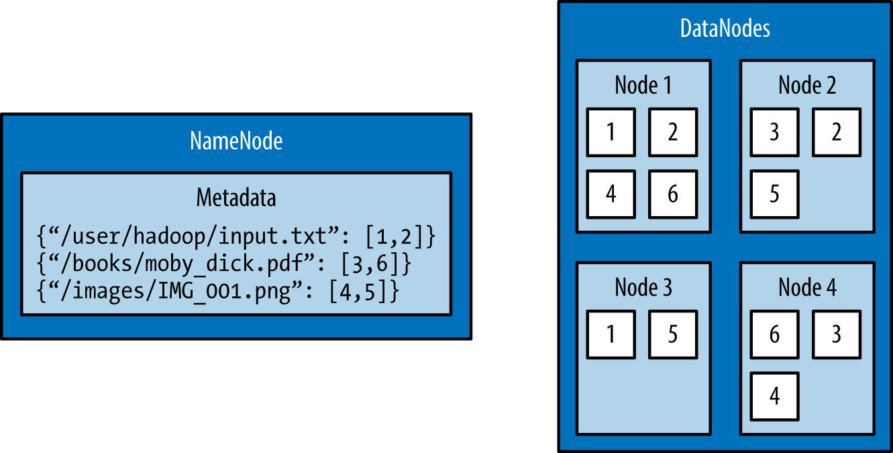
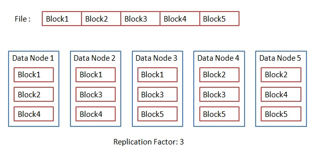
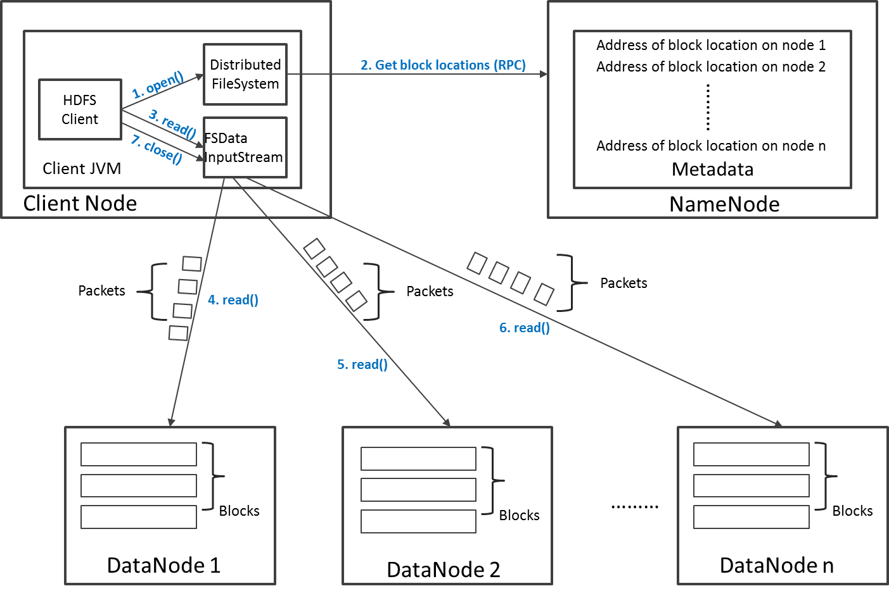
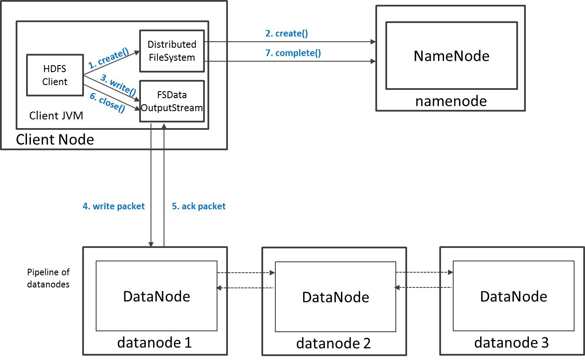

<!-- _class: lead -->

# Introduction to HDFS
### Hadoop Distributed File System

Mahmoud Parsian
Ph.D. in Computer Science

---

## What's Hadoop?

An open-source framework that:

- Efficiently **stores** large datasets, from gigabytes to petabytes.
- Efficiently **processes** those datasets, by implementing the
  MapReduce paradigm (`map()`, `reduce()`, optional `combine()`).

**HDFS** — Hadoop Distributed File System — is the piece that
handles storage: a distributed file system for large datasets running
on commodity hardware.

---

## What's HDFS?

- **Fault tolerant**, **scalable**, and easy to expand.
- The **primary distributed storage** for Hadoop applications.
- Provides interfaces that let applications move their computation
  *closer to the data* — the same "close to the data" scheduling
  principle from
  [`04_word_count_in_mapreduce.md`](04_word_count_in_mapreduce.md).

---

## Where HDFS Fits in the Cluster



---

## Where HDFS Fits in the Cluster (Continued)

Applications submit work to a Cluster Manager, which dispatches it to
executors on worker nodes. HDFS is the storage layer those workers
read from and write to.

---

## Sizing Example

A 15-node cluster: 1 Master (stores metadata only, no actual data) +
14 worker nodes, each able to store 100TB:

```text
total usable storage = 14 x 100TB = 1400TB
```

---

## HDFS Architecture



---

## Two Kinds of Nodes

- **NameNode** (master) — the heart of the filesystem. Maintains and
  manages metadata only: which blocks make up a file, and which
  DataNodes those blocks live on. Stores no actual data.
- **DataNode** (worker) — stores the actual data, and runs mappers
  and reducers.

A **Secondary NameNode** backs up the namespace (metadata), and
DataNodes send heartbeats so the NameNode can direct replication and
load balancing.

---

## Features of HDFS

- **Fault tolerant** — data is duplicated across multiple DataNodes
  (default replication factor: 3).
- **Scalable** — reads/writes go directly to DataNodes, so capacity
  scales with the number of DataNodes.
- **Space** — need more storage? Add more DataNodes and rebalance.
- **Industry standard** — HBase, MapReduce, and others build on HDFS.

**Write-once-read-many** semantics: you can add files and delete
files, but you **cannot** update/edit an existing file's contents.

---

## Data Organization: Blocks and Replicas

- Every file written to HDFS is split into **blocks**.
- Each block is stored on one or more DataNodes; each copy is a
  **replica**.
- Default **block placement policy**:
  1. First replica → the local node.
  2. Second replica → a different rack.
  3. Third replica → the same rack as the second.

---

## Example: Splitting a File Into Blocks



Block size 128MB, file size 400MB → 4 blocks: three full 128MB
blocks, plus a 16MB block. Note the **whole** 128MB is *allocated*
for that last block even though only 16MB is used.

---

## From Blocks to Mappers

HDFS block size directly sets the *default* number of mappers a
MapReduce job gets — one map task per block (the same "one mapper
per partition" idea from
[`04_word_count_in_mapreduce.md`](04_word_count_in_mapreduce.md)'s
"How Many Mappers Are Needed?"):

```text
File size = 100 GB,  Block size = 128 MB
100 GB / 128 MB ≈ 800 blocks  ->  ~800 mappers by default
```

Smaller blocks → more, smaller mappers (more parallelism, more
scheduling overhead). Larger blocks → fewer, bigger mappers (less
overhead, less parallelism). This is *why* block size is
configurable per job, not fixed forever at the cluster default.

---

## Example: NameNode Metadata → DataNode Blocks



---

## Example: NameNode Metadata → DataNode Blocks (Continued)

The NameNode's metadata is just a map from filename to block IDs
(`"/user/hadoop/input.txt": [1,2]`) — the actual block *contents*
live on the DataNodes, often with each block duplicated across more
than one node.

---

## Replication in Action



With a replication factor of 3, each of the file's 5 blocks lands on
3 different DataNodes. **What happens if one DataNode fails?** Every
block it held still has at least 2 other copies elsewhere — no data
lost, and the NameNode directs re-replication to restore the count.

---

## Higher Replication = Less Usable Storage, More Cost

5-node cluster: 1 Master (no data) + 4 DataNodes, 50TB each
(200TB raw):

| Replication factor | Usable storage | Notes |
|---|---|---|
| 1 | 200 / 1 = 200TB | no redundancy |
| 2 | 200 / 2 = 100TB | |
| 3 | 200 / 3 ≈ 67TB | HDFS default |
| 5 | 200 / 5 = 40TB | 160TB of raw disk is *unusable* for this |

More copies buys more fault tolerance, at a direct, linear cost in
usable capacity.

---

## Fault Tolerance: How Many Nodes Can Fail?

With replication factor `N` (and `N` DataNodes), **`N - 1` nodes can
safely fail** without losing data.

**Example:** replication factor 3 → 2 nodes can safely fail.

Pushing replication all the way up to `N` (every node has a full
copy) tolerates the most failures — but at the storage cost shown on
the previous slide. "Very expensive" is the exact trade-off, not a
free lunch.

---

## Read Operation in HDFS



---

## Read Operation in HDFS (Continued)

The client asks the NameNode for block locations, then reads the
actual block *data* directly from the DataNodes — the NameNode is
never on the data path itself, only the metadata path.

---

## Write Operation in HDFS



---

## Write Operation in HDFS (Continued)

The client asks the NameNode to `create()` the file, then streams
data packets through a **pipeline of DataNodes** (each acknowledging
the previous one) before telling the NameNode the write is
`complete()`.

---

## HDFS Security

- **Authentication:** `simple` (trusts the OS username — insecure) or
  `kerberos` (ticket-based), set via
  `hadoop.security.authentication`.
- **File/directory permissions** follow POSIX: read/write/execute,
  owner/group/mode — enabled by default.
- **ACLs** handle permissions that don't fit the natural
  user/group hierarchy, enabled via `dfs.namenode.acls.enabled`.

---

## Configuration Essentials

Defaults: block size **256MB**, replication factor **3**, Web UI
port **50070**. Set in `hdfs-site.xml`:

```xml
<property>
  <name>dfs.blocksize</name>
  <value>268435456</value>
</property>
<property>
  <name>dfs.replication</name>
  <value>3</value>
</property>
```

---

## Interfaces to HDFS

Java API (`DistributedFileSystem`), a C wrapper (`libhdfs`), HTTP,
WebDAV — and the **shell**, which is usually the simplest and most
familiar way in.

```text
hdfs dfs      — filesystem commands (user)
hdfs fsck     — filesystem checking (user)
hdfs dfsadmin — administration commands
```

---

## Shell Command Cheat Sheet: Files

| What | Command |
|---|---|
| List a directory | `hdfs dfs -ls /path` |
| Disk usage | `hdfs dfs -du -h /path` |
| Copy local → HDFS | `hdfs dfs -copyFromLocal local.csv /data/` |
| Copy HDFS → local | `hdfs dfs -copyToLocal /data/f.csv f.csv` |
| Remove a file | `hdfs dfs -rm /path/file` |
| List ACLs | `hdfs dfs -getfacl /path/file` |

---

## Shell Command Cheat Sheet: Diagnostics & Admin

| What | Command |
|---|---|
| Replication factor of a file | `hdfs dfs -stat "%r" /path/file` |
| Block locations for a file | `hdfs fsck /path/file -files -blocks -locations` |
| Find corrupt blocks | `hdfs fsck / -list-corruptfileblocks` |
| Cluster status report | `hdfs dfsadmin -report` |
| Rack topology | `hdfs dfsadmin -printTopology` |

---

<!-- _class: lead -->

## Summary: HDFS

HDFS is the fault-tolerant storage layer underneath Hadoop and its
ecosystem (Spark, Tez, and others can all use it). Replication is
what makes it fault-tolerant — data survives hardware failure — and
serving reads/writes in parallel across DataNodes is what makes it
fast. It's designed around **write-once, read-many-times** access.
