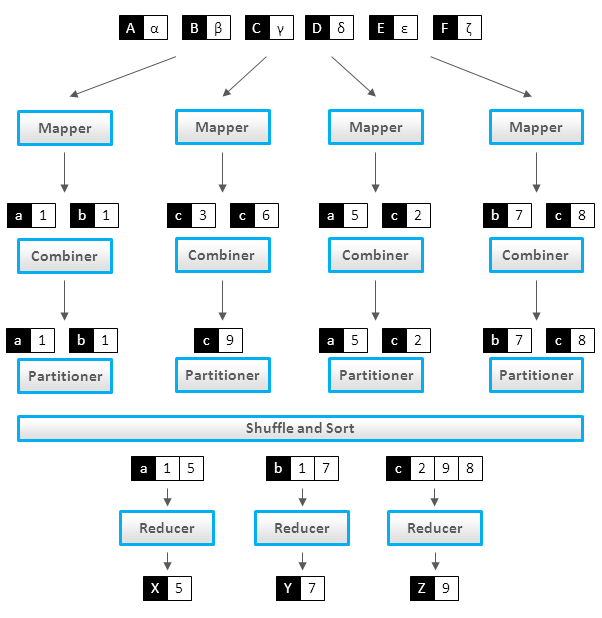

<!-- _class: lead -->

# Combiners in MapReduce

Mahmoud Parsian
Ph.D. in Computer Science

---

## Table of Contents

1. What Is a Combiner?
2. The Correctness Requirement
3. A Minimal Concrete Example
4. Not Every Aggregate Can Be Combined
5. Where the Full Depth Already Lives
6. References

---

## 1. What Is a Combiner?

A **combiner** — also called a "mini-reducer" — summarizes a single
mapper's output for one key *before* it ever leaves that mapper,
i.e. before Sort & Shuffle ships it across the network.

```text
map() -> combine() [OPTIONAL] -> partition/shuffle -> reduce()
```

It's optional, and it runs entirely locally, once 
per mapper — never across mappers.

---

## Where It Sits in the Pipeline



Each mapper's own combiner only ever sees *that mapper's* output —
`Mapper 1`'s combiner never sees `Mapper 2`'s records. Notice the
`Partitioner` still runs *after* the combiner, on the combiner's
(smaller) output.

---

## 2. The Correctness Requirement

A combiner is only safe to use if the reduce function is
**associative and commutative** — because Spark/Hadoop are free to
apply it zero, one, or many times, in any order, on any subset of a
key's values, and the result still has to match running `reduce()`
on the raw values directly.

```text
Commutative:  F(a, b) = F(b, a)
Associative:  F(a, F(b, c)) = F(F(a, b), c)
```

`SUM` and `COUNT` satisfy both. **Not every aggregate does** — and
getting this wrong produces a silently *wrong* answer, not a crash.

---

## 3. A Minimal Concrete Example

Two mappers, same key `K`, computing `SUM`:

```text
Mapper 1's output for K: (K,2), (K,3), (K,4)
Mapper 2's output for K: (K,5), (K,6), (K,7), (K,8)
```

**Without** a combiner, all 7 raw values cross the network:

```text
reduce(K, [2,3,4,5,6,7,8]) -> 35
```

**With** a combiner, each mapper pre-sums its own values *first* —
only 2 numbers cross the network instead of 7:

```text
combine(K, [2,3,4]) -> 9         combine(K, [5,6,7,8]) -> 26
reduce(K, [9, 26]) -> 35          # same answer, less shuffled data
```

---

## That's the Whole Idea

This is the whole trick, at the smallest possible scale — the fuller
examples ahead just repeat it over more keys, more partitions, and
(for `AVERAGE`) a value that needs `(sum, count)` instead of a bare
number.

---

## 4. Not Every Aggregate Can Be Combined

`AVERAGE` *looks* hard but isn't — deck
[09](09_mapreduce_example_with_combiners.md) shows the `(sum, count)`
fix. Some aggregates have **no fix at all**: no matter how you shape
the intermediate value, a partial summary can't be merged into the
correct final answer.

These are called **holistic** aggregates. `MEDIAN`, `MODE`, and exact
`DISTINCT COUNT` are the classic hard cases — three concrete examples
of *why* follow.

---

## Hard Case 1: MEDIAN

```text
Mapper 1's values: [10, 20, 30]         -> local median = 20
Mapper 2's values: [40, 50, 60, 70, 90] -> local median = 60
```

A combiner that emits `(20, 60)`, reduced by averaging, gives
`(20+60)/2 = 40`.

```text
True median of [10,20,30,40,50,60,70,90] (n=8)
  = average of the 4th and 5th sorted values
  = (40+50)/2 = 45          # not 40
```

`median(A)` and `median(B)` alone don't carry enough information to
recover `median(A ∪ B)` — the two local medians "forget" how many
values sit on each side of them.

---

## Hard Case 2: MODE

A **naive** combiner keeps only each mapper's *local* winner + count:

```text
Mapper 1's values: A,A,A,C,C  -> counts A=3, C=2 -> local mode = A (3)
Mapper 2's values: B,B,B,C,C  -> counts B=3, C=2 -> local mode = B (3)
```

The combiner forwards only `(A,3)` and `(B,3)` — **`C` is never a
local winner, so it never gets forwarded at all**:

```text
True global counts: A=3, B=3, C=4  ->  true mode is C
```

The reducer can't pick a winner it never saw. Fix: forward the *full*
per-key frequency table (like Word Count), not just the winner — but
then the combiner is only as small as the key's distinct-value count.

---

## Hard Case 3: Exact DISTINCT COUNT

Here the combiner is *correct* — but often pointless.

```text
Mapper 1 sees user IDs for key K: {101, 102, 103, 104, 105}  # all distinct
Mapper 2 sees user IDs for key K: {103, 106, 107}
```

Local dedup inside Mapper 1 removes nothing — none of its 5 IDs
repeat *within that mapper*. The combiner ships all 5 values anyway.
The reducer still has to union every mapper's set to find the true
answer (7 distinct IDs, since `103` overlaps).

A set-union combiner is *safe to add*, but buys no shuffle-size
reduction unless duplicates happen to cluster inside one mapper —
often they don't.

---

## Rule of Thumb

| Aggregate | Combiner? |
|---|---|
| `SUM`, `COUNT`, `MAX`, `MIN` | ✅ trivial — value itself is the summary |
| `AVERAGE`, `VARIANCE`, `STDDEV` | ✅ with the right intermediate value (`sum`, `count`, `sum of squares`) |
| `DISTINCT COUNT` (exact) | ⚠️ correct, rarely helps |
| `MEDIAN`, `PERCENTILE`, `MODE` | ❌ no exact fix — approximate instead |

---

## The General Test

**Plain-English version:** when you need *all* — or nearly all — of
a key's raw values at once to get the correct answer, the option of
a simple combiner disappears.

**Precise version:** if you can't name a **fixed-size intermediate
value** that a merge function can combine two-at-a-time and still
get the exact right answer, you likely have a holistic aggregate on
your hands.

Don't force a combiner onto it — reach for an approximation
algorithm instead: `t-digest`/`KLL` for median & percentiles,
`HyperLogLog` for distinct count, frequency sketches for mode.

---

<!-- _class: lead -->

## 5. Where the Full Depth Already Lives

This repo already has a **1400+ line**, rigorously worked-out
treatment of exactly this question — associativity, commutativity,
the classic "average of an average is not an average" trap (and its
fix), a catalog of which aggregates are safe (`SUM`, `MAX`, `COUNT`)
and which aren't (`AVERAGE`, `MEDIAN`, subtraction, division), plus a
design checklist and a partition-invariance test:

**[`associativity_and_commutativity/Associativity_Commutativity_and_Reducers.md`](../associativity_and_commutativity/Associativity_Commutativity_and_Reducers.md)**

Read that document for the *why* and the *how to check your own
reducer*. Nothing in this deck said it better, so nothing here
repeats it.

---

## Worked Examples, With and Without a Combiner

Full side-by-side worked examples (same problem, solved once without
a combiner and once with one, so you can see exactly what changes):

- [`combiners/MapReduce_with_Combiners.md`](../combiners/MapReduce_with_Combiners.md) — average, and `(avg, min, max)`, per gene
- [`combiners/Word_Count_in_MapReduce.md`](../combiners/Word_Count_in_MapReduce.md) — Word Count, with a combiner

And in this folder specifically, the temperature-per-city example
worked both ways:

- [`08_mapreduce_example_without_combiners.md`](08_mapreduce_example_without_combiners.md)
- [`09_mapreduce_example_with_combiners.md`](09_mapreduce_example_with_combiners.md)

---

<!-- _class: lead -->

## 6. References

1. [Monoidify! Monoids as a Design Principle for Efficient MapReduce Algorithms](../monoids/Monoids_as_a_Design_Principle_for_Efficient_MapReduce_Algorithms.pdf) — Jimmy Lin (and see Mahmoud's own [`monoids/monoid_as_a_design_principle.md`](../monoids/monoid_as_a_design_principle.md) covering the same ground)
2. *Data Algorithms* — Mahmoud Parsian
3. *Data Algorithms with Spark* — Mahmoud Parsian
