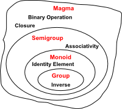

# Monoid: A Design Principle <br> for <br>Correct and Efficient Reducers

	Author: Mahmoud Parsian
	Last updated: 8/19/2026

## Table of Contents

1. [Introduction](#1-introduction)
2. [The Hierarchy of Algebraic Structures](#2-the-hierarchy-of-algebraic-structures)
3. [The Associative Law](#3-the-associative-law)
4. [The Commutative Law](#4-the-commutative-law)
5. [Semigroup](#5-semigroup)
6. [Monoid](#6-monoid)
7. [Monoid and No-Monoid Examples](#7-monoid-and-no-monoid-examples)
8. [Monoids as a Design Principle for Efficient MapReduce Algorithms](#8-monoids-as-a-design-principle-for-efficient-mapreduce-algorithms)
9. [Case Study: Why "Average of Averages" Is Not the Average](#9-case-study-why-average-of-averages-is-not-the-average)
10. [Monoids and Spark's `reduceByKey()`](#10-monoids-and-sparks-reducebykey)
11. [More Monoid Examples in Big Data](#11-more-monoid-examples-in-big-data)
12. [Monoids in Programming Languages](#12-monoids-in-programming-languages)
13. [Exercises](#13-exercises)
14. [Summary](#14-summary)
15. [References](#15-references)

---

## 1. Introduction

In this article, I define a **monoid** and show how it can help us write
*semantically correct* and *efficient* reducers in MapReduce
(`reduce()` and `combine()`) and Spark (`reduceByKey()`,
`aggregateByKey()`, `fold()`, `foldByKey()`).

In abstract algebra (the study of algebraic structures), a **monoid**
is a set equipped with an associative binary operation and an identity
element. That is a compact definition — the rest of this article unpacks
it piece by piece, and then puts it to work.

Why should a big-data practitioner care about a 19th-century algebra
concept? Because **a reducer is only safe to run in parallel, in any
order, on any grouping of the data, if the underlying operation is
associative** — and it is only safe to combine partial results with an
"empty" partition, or seed an accumulator, if the operation has an
**identity element**. Those two properties, together, are exactly what
a monoid guarantees. Before defining a monoid formally, we first look at
the two properties — associativity and commutativity — that any
correct reducer depends on.

## 2. The Hierarchy of Algebraic Structures



The diagram above shows a nested family of algebraic structures, each
one adding exactly one more property to the one before it:

| Structure     | Adds this property        | Requirement |
|---------------|----------------------------|-------------|
| **Magma**     | Closure                    | `f(a, b)` is defined and stays in the same set `X` |
| **Semigroup** | + Associativity             | `f(a, f(b, c)) = f(f(a, b), c)` |
| **Monoid**    | + Identity element           | there is an `i` with `f(a, i) = f(i, a) = a` |
| **Group**     | + Inverse                    | every `a` has an `a⁻¹` with `f(a, a⁻¹) = i` |

For reducers, this hierarchy tells us exactly how much algebraic
structure we need — and, just as importantly, how much we *don't*
need:

* We need **closure**, so a partial result can be fed back into the
  same reducer.
* We need **associativity**, so the framework is free to combine
  values in any grouping (mapper-side combiners, shuffle-side merges,
  tree reduction).
* We need an **identity element**, so an accumulator can be seeded and
  an empty partition contributes nothing.
* We do **not** need an **inverse**. There is no way to "un-add" a word
  count or "un-union" a set, and a reducer never needs one — which is
  why `reduceByKey()` only ever asks for a monoid (in fact, a
  *commutative* monoid — see [Section 10](#10-monoids-and-sparks-reducebykey)), never a full group.

In short: **a monoid is exactly the amount of algebraic structure a
distributed reducer needs — no more, no less.**

## 3. The Associative Law

An associative operation

	f: X x X -> X

is a binary operation such that for all `a, b, c` in `X`:

	f(a, f(b, c)) = f(f(a, b), c)

For example, `+` (addition) is associative:

	(a + (b + c)) = ((a + b) + c)

`*` (multiplication) is associative:

	(a * (b * c)) = ((a * b) * c)

`-` (subtraction) is **not** associative:

	(4 - (6 - 3)) != ((4 - 6) - 3)
	         (4 - 3) != (-2 - 3)
	               1 != -5

Neither is `avg` (average):

	FACT: avg(1, 2, 3) = 2

	avg(1, avg(2, 3)) != avg(avg(1, 2), 3)
	      avg(1, 2.5) != avg(1.5, 3)
	             1.75 != 2.25

This last example is not a curiosity — it is the single most common
correctness bug in MapReduce/Spark aggregation code, and it is the
subject of [Section 9](#9-case-study-why-average-of-averages-is-not-the-average).

## 4. The Commutative Law

A commutative function `f` is a function that takes multiple inputs
from a set `X` and produces an output that does not depend on the
order of the inputs:

	f(a, b) = f(b, a)

`+` is commutative: `2 + 5 = 5 + 2 = 7`.

`*` is commutative: `2 * 5 = 5 * 2 = 10`.

`-` (subtraction) is **not** commutative:

	2 - 4 != 4 - 2
	   -2 != 2

`/` (division) is **not** commutative:

	2 / 4 != 4 / 2
	  0.5 != 2

Associativity and commutativity are independent properties — a
function can have either one without the other. For a MapReduce/Spark
reducer we typically need *both*: associativity because partial
results are combined in a tree (mapper combiners, then shuffle merges,
then the final reduce), and commutativity because the framework makes
no promise about the *order* in which values, or partitions, arrive at
a reducer.

## 5. Semigroup

A **semigroup** is a set `S` together with a binary operation `f`:

	f: S x S -> S

that satisfies the associative property: for all `a, b, c` in `S`,

	f(a, f(b, c)) = f(f(a, b), c)

A semigroup guarantees associativity, but not an identity element.

Semigroup examples:

* The set of **positive** integers with addition. (There is no
  positive integer that acts as an identity for `+`; once `0` is
  included, this becomes a monoid — see below.)

* The set of integers with `min` or `max`. (There is no integer that
  acts as an identity for `min`/`max`; once `+∞`/`-∞` is included,
  this becomes a monoid.)

Every monoid is a semigroup, but not every semigroup is a monoid — a
semigroup only becomes a monoid once we can name an identity element
that already lives in the set.

## 6. Monoid

A monoid `M` is a triplet `(X, f, i)`, where

* `X` is a set,
* `f` is an associative binary operator on `X`, and
* `i` is an identity element in `X`.

The monoid axioms (which govern the behavior of `f`) are:

1. **Closure.** For all `a, b` in `X`, `f(a, b)` is also in `X`.

2. **Associativity.** For all `a, b, c` in `X`:

		f(a, f(b, c)) = f(f(a, b), c)

3. **Identity.** There is an `i` in `X` (called the **identity
   element**) such that, for all `a` in `X`:

		f(a, i) = a
		f(i, a) = a

Equivalently: **a monoid is a semigroup with an identity element.**

**The identity element is unique.** This is worth proving, since it is
what lets us talk about *the* identity element rather than *an*
identity element. Suppose `i` and `i'` are both identity elements of
`(X, f)`. Then

	i = f(i, i')     (since i' is an identity)
	  = i'            (since i is an identity)

so `i = i'`. This uniqueness is exactly what makes it safe to hard-code
a single "zero value" as the seed for an accumulator, regardless of
how many partitions, mappers, or combiners touch it.

## 7. Monoid and No-Monoid Examples

### 7.1 Monoid Examples

| Monoid `(X, f, i)` | Set `X` | Operation `f` | Identity `i` |
|---|---|---|---|
| `(X, +, 0)` | non-negative integers | addition | `0` |
| `(X, *, 1)` | non-negative integers | multiplication | `1` |
| `(S, \|\|, "")` | strings, including `""` | concatenation | `""` |

### 7.2 No-Monoid Examples

1. `(X, -, 0)` over non-negative integers is **not** a monoid, because
   subtraction is not associative.

2. `(X, /, 1)` over non-negative integers is **not** a monoid, because
   division is not associative.

3. `(X, AVG, 0)`, where `AVG(a, b)` returns the average of `a` and
   `b`, is **not** a monoid, because averaging is not associative
   (see [Section 3](#3-the-associative-law)).

### 7.3 Quick Reference

| Operation | Associative? | Commutative? | Identity element |
|---|---|---|---|
| `+` | ✅ | ✅ | `0` |
| `*` | ✅ | ✅ | `1` |
| `min` / `max` | ✅ | ✅ | `+∞` / `-∞` |
| string `\|\|` (concat) | ✅ | ❌ | `""` |
| set `∪` (union) | ✅ | ✅ | `∅` |
| `-` (subtraction) | ❌ | ❌ | — |
| `/` (division) | ❌ | ❌ | — |
| `avg` (average) | ❌ | ✅ | — |

Two things stand out. First, an operation can be commutative and still
fail to be a monoid — `avg` is the running example throughout this
article. Second, an operation can be associative but not commutative
(string concatenation) and still be a perfectly good monoid; Spark's
`reduceByKey()` happens to additionally require commutativity, which
is discussed in [Section 10](#10-monoids-and-sparks-reducebykey).

## 8. Monoids as a Design Principle for Efficient MapReduce Algorithms

According to [Jimmy Lin](https://arxiv.org/abs/1304.7544):

> "It is well known that since the sort/shuffle stage in MapReduce is
> costly, local aggregation is one important principle to designing
> efficient algorithms. This short paper represents an attempt to more
> clearly articulate this design principle in terms of monoids, which
> generalizes the use of combiners and the in-mapper combining
> pattern."

For example, in PySpark, in a distributed environment, we **cannot**
write the following transformation to find the average of integer
values per key:

```python
# rdd: RDD[(key, value)] where value is an Integer
# The following transformation is WRONG:
avg_per_key = rdd.reduceByKey(lambda x, y: (x + y) / 2)
```

This does not work, because the average of averages is not the
average (Section 3). `RDD.reduceByKey()` merges the values for each
key using an **associative** (and, per the Spark documentation,
**commutative**) reduce function, and `avg` is not associative.

**How do we fix this? Turn it into a monoid.** The standard technique
— sometimes called *monoidification* — is to replace each raw value
with a small, fixed-size structure that *is* closed under an
associative combine, and only compute the final answer once, at the
very end:

```python
# rdd: RDD[(key, value)] where value is an Integer
# Step 1: convert (key, value) into (key, (value, 1))
#         so each record carries its own partial sum and count.
rdd2 = rdd.mapValues(lambda v: (v, 1))
# rdd2: RDD[(key, (sum, count))]

# Step 2: combine (sum, count) pairs per key -- this IS a monoid.
sum_count_per_key = rdd2.reduceByKey(
    lambda x, y: (x[0] + y[0], x[1] + y[1])
)

# Step 3: divide once, at the very end, to get the average per key.
avg_per_key = sum_count_per_key.mapValues(
    lambda v: float(v[0]) / v[1]
)
```

By mapping `(key, value)` to `(key, (value, 1))`, the combine step
becomes pairwise addition of `(sum, count)` tuples, which *is* a
monoid. Consider the following two partitions:

	Partition-1        Partition-2
	(A, 1)             (A, 3)
	(A, 2)

Mapping `(key, value)` to `(key, (value, 1))` gives `rdd2`:

	Partition-1          Partition-2
	(A, (1, 1))          (A, (3, 1))
	(A, (2, 1))

`sum_count_per_key` then holds:

	Partition-1          Partition-2
	(A, (3, 2))          (A, (3, 1))

Finally, `avg_per_key` produces the correct final value per key:
`(A, 2.0)`.

**Proof that `(sum, count)` pairs form a monoid**, with identity
element `(0, 0)`:

* Associativity:

		((s1, c1) + (s2, c2)) + (s3, c3) = (s1+s2+s3, c1+c2+c3)
		(s1, c1) + ((s2, c2) + (s3, c3)) = (s1+s2+s3, c1+c2+c3)

* Identity:

		(s, c) + (0, 0) = (s, c)
		(0, 0) + (s, c) = (s, c)

This is the general pattern: when the value you ultimately want (like
`avg`) is *not* itself a monoid, look for a small, fixed-size
intermediate representation that *is* a monoid, carry that through the
combiners and reducers, and derive the final answer with one cheap,
non-associative step at the very end.

## 9. Case Study: Why "Average of Averages" Is Not the Average

In distributed computing environments (MapReduce, Hadoop, Spark, ...),
correctness matters as much as speed. Suppose we have only two
partitions:

	Partition-1        Partition-2
	(A, 1)             (A, 3)
	(A, 2)

and we want the average per key. Looking at all three values together,
the average of `(1, 2, 3)` is exactly `2.0`. But in a distributed
environment, the average is computed **per partition first**, and then
those partial averages must somehow be combined:

	Partition-1: avg(1, 2) = 1.5
	Partition-2: avg(3)    = 3.0

	avg(Partition-1, Partition-2) = (1.5 + 3.0) / 2 = 2.25

	===> WRONG. The correct average is 2.0, not 2.25.

The partition boundary silently changed the answer — and worse, that
boundary is an implementation detail of the cluster (number of
partitions, number of executors), not something the algorithm should
be sensitive to. To fix this, we change what the mappers emit: instead
of `(key, value)`, they emit `(key, (sum, count))`, exactly as in
[Section 8](#8-monoids-as-a-design-principle-for-efficient-mapreduce-algorithms):

	Partition-1        Partition-2
	(A, (1, 1))        (A, (3, 1))
	(A, (2, 1))

Now combine using `+` on `(sum, count)` pairs, and divide only once, at
the end:

	Partition-1: (1, 1) + (2, 1) = (3, 2)
	Partition-2:                   (3, 1)

	(sum, count) totals = (3, 2) + (3, 1) = (6, 3)

	avg = 6 / 3 = 2.0     ===> CORRECT, regardless of partitioning.

Because `(sum, count)` addition is associative and commutative, this
answer is **the same no matter how the data is partitioned, in what
order the partitions are combined, or how many combiner stages run**
— which is precisely the guarantee a monoid gives us, and precisely
the guarantee that plain `avg` cannot.

## 10. Monoids and Spark's `reduceByKey()`

When using `pyspark.RDD.reduceByKey()`, you must make sure that your
data's value type, together with the binary operation you supply,
forms a monoid — otherwise combiners (which Spark may apply
opportunistically, on arbitrary subsets, in arbitrary order) can
silently produce an incorrect result. Per the Spark documentation,
`RDD.reduceByKey()` merges the values for each key using an
**associative and commutative** reduce function.

	# rdd: RDD[(key, value)]
	reduced = rdd.reduceByKey(lambda x, y: f(x, y))

So before writing `f`, ask two questions:

1. **Is `f` associative?** If not, `reduceByKey()` will give
   partition-dependent (i.e., non-deterministic) results. This is the
   monoid property from [Section 6](#6-monoid).
2. **Is `f` commutative?** If not, results can depend on the arrival
   order of values within a partition, which Spark also does not
   guarantee.

If either answer is "no," `f` needs to be redesigned — usually by
applying the monoidification technique from [Section 8](#8-monoids-as-a-design-principle-for-efficient-mapreduce-algorithms):
replace the value with a small associative-and-commutative
intermediate structure, and compute the real answer in a final
`map()`/`mapValues()` step outside of `reduceByKey()`.

## 11. More Monoid Examples in Big Data

The `(sum, count)` trick for `avg` generalizes. Many aggregates used
in analytics and big-data systems are monoids once you pick the right
intermediate representation:

| Aggregate | Value type | Combine `f` | Identity `i` |
|---|---|---|---|
| Sum | number | `+` | `0` |
| Count | integer | `+` | `0` |
| Min | comparable | `min` | `+∞` |
| Max | comparable | `max` | `-∞` |
| Distinct elements | set | `∪` | `∅` |
| Average | `(sum, count)` | pairwise `+` | `(0, 0)` |
| Variance / std-dev | `(sum, sumSq, count)` | pairwise `+` | `(0, 0, 0)` |
| Top-*N* list | bounded list | merge, sort, truncate to *N* | `[]` |
| Approximate distinct count | HyperLogLog sketch | register-wise `max` | all-zero sketch |
| Approximate set membership | Bloom filter (bit array) | bitwise `OR` | all-zero array |

Variance follows the same recipe as average: carry `sum`, `sumSq`
(sum of squares), and `count` through the combiners —

```python
# rdd: RDD[(key, value)] where value is a Double
triples = rdd.mapValues(lambda v: (v, v * v, 1))
# triples: RDD[(key, (sum, sumSq, count))]

agg = triples.reduceByKey(
    lambda x, y: (x[0] + y[0], x[1] + y[1], x[2] + y[2])
)

def variance(t):
    s, sq, n = t
    mean = s / n
    return sq / n - mean * mean

variance_per_key = agg.mapValues(variance)
```

— and divide only once, at the very end, exactly as with `avg`.

Not every aggregate has a small fixed-size monoid representation.
Classic OLAP terminology (Gray et al.) calls an aggregate
**distributive** if it *is* directly a monoid (`sum`, `count`,
`min`, `max`), **algebraic** if it can be computed from a
*bounded-size* monoid (`avg`, `variance`, and, approximately,
`distinct count` via HyperLogLog), and **holistic** if no such
bounded-size monoid exists at all (exact `median`, exact `distinct
count` at scale) — those require a full pass over the grouped data, or
an explicit approximation. Framing an aggregate this way — "what is
the smallest monoid that captures this?" — is the design principle
this article is named for. Twitter's open-source
[**Algebird**](https://github.com/twitter/algebird) library is a good
place to see this principle taken to its logical conclusion: it
implements dozens of monoids (including HyperLogLog and Bloom filters)
specifically so they can be plugged into Scalding/Spark aggregations.

## 12. Monoids in Programming Languages

Monoids show up in functional programming languages such as Haskell
and Scala, where they generalize over data types whose values can be
"combined" by some operation, and which include an "empty" value (the
identity element).

Further reading:

* [Monoids in Haskell, an Introduction](https://gist.github.com/cscalfani/b0a263cf1d33d5d75ca746d81dac95c5#file-monoidsinhaskellanintroductions-md)
* [Functional Programming in Scala, Monoids](https://livebook.manning.com/book/functional-programming-in-scala/chapter-10/)

## 13. Exercises

1. Is `(X, f, 1)` a monoid, where `X` is the set of positive integers
   and `f(a, b) = gcd(a, b)`? Identify the identity element, or explain
   why none exists.
2. Prove that `min` over the extended integers (integers plus `+∞`) is
   associative and commutative, and that `+∞` is its identity element.
3. `RDD.reduceByKey()` requires an associative *and* commutative
   function. Give an example of an operation that is associative but
   **not** commutative, and explain what could go wrong if you used it
   with `reduceByKey()` on a real cluster.
4. Design a monoid to compute, per key, the **range** (`max - min`) of
   a stream of numbers using only `reduceByKey()`. What intermediate
   structure do you carry through the combiners?
5. Is the set of all `(key, value)` maps, with "merge, summing values
   on key collision," a monoid? What is its identity element?
6. Explain, in your own words and using the diagram in
   [Section 2](#2-the-hierarchy-of-algebraic-structures), why a
   MapReduce reducer needs a monoid but never needs a group.

## 14. Summary

* A **monoid** is a set with an associative binary operation and a
  unique identity element — nothing more, and (for our purposes)
  nothing less.
* **Associativity** is what allows a reducer to run as a tree of
  partial combines (combiners, shuffle merges, final reduce) instead
  of one giant sequential fold.
* The **identity element** is what allows an accumulator to be safely
  seeded and an empty partition to contribute nothing.
* Not every aggregate you want (like `avg`) is itself a monoid — but
  it can usually be computed from a small, fixed-size structure that
  *is* one (`(sum, count)`, `(sum, sumSq, count)`, a HyperLogLog
  sketch, ...). Finding that structure is the design principle this
  article is named for.
* When in doubt about a Spark `reduceByKey()` (or a MapReduce
  `reduce()`/`combine()`) function, ask: *is this a monoid?* If the
  answer is no, the code is a correctness bug waiting for a cluster
  with more than one partition.

## 15. References

1. [Data Algorithms with Spark by Mahmoud Parsian](https://www.oreilly.com/library/view/data-algorithms-with/9781492082378/)
2. [Monoidify! Monoids as a Design Principle for Efficient MapReduce Algorithms by Jimmy Lin](https://arxiv.org/pdf/1304.7544.pdf)
3. [Google's MapReduce Programming Model — Revisited by Ralf Lämmel](https://userpages.uni-koblenz.de/~laemmel/MapReduce/paper.pdf)
4. [Data-Intensive Text Processing with MapReduce by Jimmy Lin and Chris Dyer](https://lintool.github.io/MapReduceAlgorithms/ed1n/MapReduce-algorithms.pdf)
5. [Semigroups, Monoids, and Groups](https://faculty.etsu.edu/gardnerr/5410/notes/I-1.pdf)
6. [Why Spark Can't foldLeft: Monoids and Associativity by Parker Gordon](https://parkergordon.io/2017/04/03/why-spark-cant-foldleft/)
7. [Monoids and Semigroups in Scala](https://www.baeldung.com/scala/monoids-semigroups)
8. [Monoidal Sparks](https://byorgey.wordpress.com/2018/10/01/monoidal-sparks/)
9. [Semigroups and Monoids in Scala](https://blog.rockthejvm.com/semigroups-and-monoids-in-scala/)
10. [Understanding Monoids Using Real-Life Examples](https://shashankbaravani.medium.com/understanding-monoids-using-real-life-examples-6ec3cb349f2f)
11. [A Monad Is Just a Monoid…](https://michelestieven.medium.com/a-monad-is-just-a-monoid-a02bd2524f66)
12. [Builder as a Monoid by Mark Seemann](https://blog.ploeh.dk/2020/02/17/builder-as-a-monoid/)
13. [Monoids in Practice](https://fsharpforfunandprofit.com/posts/monoids-part2/)
14. [Twitter Algebird](https://github.com/twitter/algebird) — a Scala library of algebraic structures (monoids, semigroups) for large-scale analytics.
15. [Associativity, Commutativity, and Reducers](../associativity_and_commutativity/Associativity_Commutativity_and_Reducers.md) — a companion article in this course with a deeper treatment of combiner correctness, algebraic/distributive/holistic aggregates, and testing strategies.
