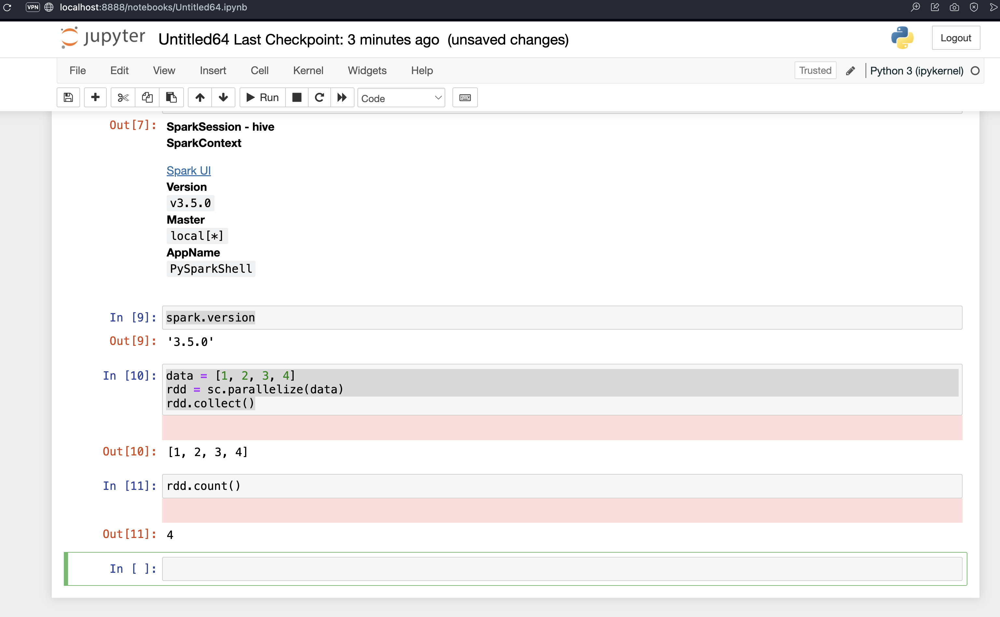

# How to Run PySpark from Jupyter

### [How To Start Jupyter for PySpark](how_to_start_jupyter_for_pyspark.md)

### [Get Started PySpark Jupyter Notebook in 3-Minutes](./get-started-pyspark-jupyter-notebook-3-minutes.pdf)

### [Basics of Pyspark Programming for RDD on Jupyter Notebook](./Basics_of_Pyspark_Programming_for_RDD_on_Jupyter_Notebook.pdf)

## Files in This Folder

| Name | Description |
|---|---|
| [`how_to_start_jupyter_for_pyspark.md`](./how_to_start_jupyter_for_pyspark.md) | Steps to start Jupyter configured for PySpark |
| [`pyspark_jupyter.sh`](./pyspark_jupyter.sh) | Shell script to launch Jupyter with PySpark |
| [`get-started-pyspark-jupyter-notebook-3-minutes.pdf`](./get-started-pyspark-jupyter-notebook-3-minutes.pdf) | Quick-start guide: PySpark in Jupyter in 3 minutes |
| [`Basics_of_Pyspark_Programming_for_RDD_on_Jupyter_Notebook.pdf`](./Basics_of_Pyspark_Programming_for_RDD_on_Jupyter_Notebook.pdf) | Basics of PySpark RDD programming in a Jupyter Notebook |
| [`Using_PySpark_in_Jupyter.png`](./Using_PySpark_in_Jupyter.png) | Screenshot shown above |
| [`pyspark_jupyter.png`](./pyspark_jupyter.png) | Additional screenshot of PySpark running in Jupyter |