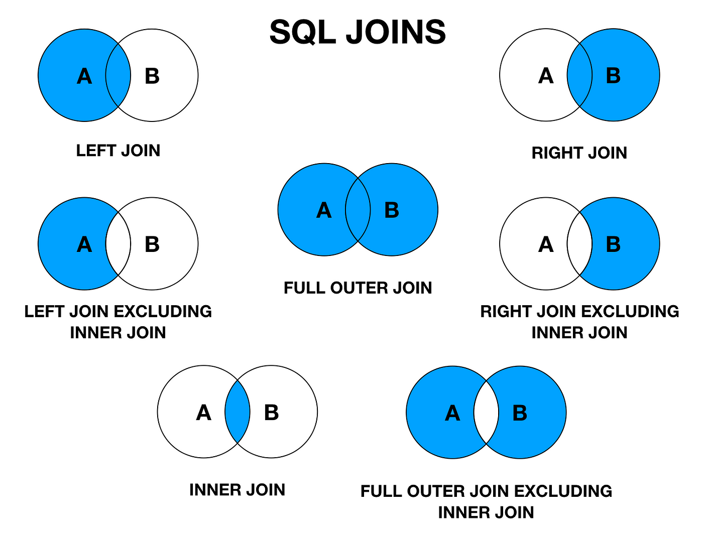

# Join Operations in RDDs, PySpark, and MapReduce


## Introduction

1. Spark supports join operations between RDDs.
2. Spark supports join operations between DataFrames.
3. The classic MapReduce paradigm does not provide a built-in join
   operation, but a join between two data sets can still be
   implemented on top of it (see [Join in the MapReduce Paradigm](#join-in-the-mapreduce-paradigm) below).

Spark RDDs support the following join operations:

* `RDD.join()` — inner join
* `RDD.leftOuterJoin()`
* `RDD.rightOuterJoin()`
* `RDD.fullOuterJoin()`
* `RDD.cogroup()`
* `RDD.groupWith()`
* `pyspark.sql.DataFrame.join()`

-------

## SQL Joins

SQL joins are explained [here](https://medium.com/@iammanolov98/mastering-sql-joins-coding-interview-preparation-innerjoin-e96bef58afc2)
and, as a second reference, on [W3Schools](https://www.w3schools.com/sql/sql_join.asp).



-------

## RDD Joins in PySpark

PySpark supports the JOIN operation for `(key, value)` RDDs.
The most common join is an inner join, supported by `RDD.join`:

```
RDD.join(other: pyspark.rdd.RDD[Tuple[K, U]],
    numPartitions: Optional[int] = None)
    → pyspark.rdd.RDD[Tuple[K, Tuple[V, U]]]

Return an RDD containing all pairs of elements
with matching keys in self and other. Each pair
of elements will be returned as a (k, (v1, v2))
tuple, where (k, v1) is in self and (k, v2) is
in other. Performs a hash join across the cluster.
```

### Example 1: Inner, Left Outer, and Right Outer Joins

```python
~  % cd spark-4.2.0
spark-4.2.0  % ./bin/pyspark
Python 3.13.2 (v3.13.2:4f8bb3947cf, Feb  4 2025, 11:51:10)
[Clang 13.0.0 (clang-1300.0.29.30)] on darwin
Welcome to
      ____              __
     / __/__  ___ _____/ /__
    _\ \/ _ \/ _ `/ __/  '_/
   /__ / .__/\_,_/_/ /_/\_\   version 4.2.0
      /_/

Using Python version 3.13.2 (v3.13.2:4f8bb3947cf, Feb  4 2025 11:51:10)
Spark context Web UI available at http://192.168.1.10:4040
Spark context available as 'sc' (master = local[*], app id = local-1788594128779).
SparkSession available as 'spark'.

>>> A = [('k1', 2), ('k1', 3), ('k2', 4), ('k2', 5), ('k3', 20), ('k4', 200)]
>>> B = [('k1', 20), ('k1', 30), ('k2', 40), ('k2', 50), ('k7', 20), ('k8', 2)]
>>> A
[('k1', 2), ('k1', 3), ('k2', 4), ('k2', 5), ('k3', 20), ('k4', 200)]
>>> B
[('k1', 20), ('k1', 30), ('k2', 40), ('k2', 50), ('k7', 20), ('k8', 2)]

>>> rdd1 = sc.parallelize(A)
>>> rdd1.collect()
[('k1', 2), ('k1', 3), ('k2', 4), ('k2', 5), ('k3', 20), ('k4', 200)]

>>> rdd2 = sc.parallelize(B)
>>> rdd2.collect()
[('k1', 20), ('k1', 30), ('k2', 40), ('k2', 50), ('k7', 20), ('k8', 2)]
>>>
>>>

>>> joined = rdd1.join(rdd2)
>>> joined.collect()
[
 ('k1', (2, 20)),
 ('k1', (2, 30)),
 ('k1', (3, 20)),
 ('k1', (3, 30)),
 ('k2', (4, 40)),
 ('k2', (4, 50)),
 ('k2', (5, 40)),
 ('k2', (5, 50))
]
>>> joined2 = rdd2.join(rdd1)
>>> joined2.collect()
[
 ('k1', (20, 2)),
 ('k1', (20, 3)),
 ('k1', (30, 2)),
 ('k1', (30, 3)),
 ('k2', (40, 4)),
 ('k2', (40, 5)),
 ('k2', (50, 4)),
 ('k2', (50, 5))
]
>>>
>>>
>>> left_outer_join = rdd1.leftOuterJoin(rdd2)
>>> left_outer_join.collect()
[
 ('k1', (2, 20)),
 ('k1', (2, 30)),
 ('k1', (3, 20)),
 ('k1', (3, 30)),
 ('k2', (4, 40)),
 ('k2', (4, 50)),
 ('k2', (5, 40)),
 ('k2', (5, 50)),
 ('k3', (20, None)),
 ('k4', (200, None))
]
>>>
>>>
>>> right_outer_join = rdd1.rightOuterJoin(rdd2)
>>> right_outer_join.collect()
[
 ('k1', (2, 20)),
 ('k1', (2, 30)),
 ('k1', (3, 20)),
 ('k1', (3, 30)),
 ('k2', (4, 40)),
 ('k2', (4, 50)),
 ('k2', (5, 40)),
 ('k2', (5, 50)),
 ('k8', (None, 2)),
 ('k7', (None, 20))
]
>>>
```

### Example 2: Inner, Left Outer, Right Outer, and Full Outer Joins

```python
% ./bin/pyspark
Python 3.13.2 (v3.13.2:4f8bb3947cf, Feb  4 2025, 11:51:10)
[Clang 13.0.0 (clang-1300.0.29.30)] on darwin
Welcome to
      ____              __
     / __/__  ___ _____/ /__
    _\ \/ _ \/ _ `/ __/  '_/
   /__ / .__/\_,_/_/ /_/\_\   version 4.2.0
      /_/

Using Python version 3.13.2 (v3.13.2:4f8bb3947cf, Feb  4 2025 11:51:10)
Spark context Web UI available at http://192.168.1.10:4040
Spark context available as 'sc'
(master = local[*], app id = local-1788594128779).
SparkSession available as 'spark'.
```

#### `RDD.join()` as Inner-Join

```python
>>>
>>> data1 = [('A', 2), ('A', 3), ('B', 4), ('B', 5),
>>>          ('C', 5), ('D', 6)]
>>>
>>> data2 = [('A', 7), ('A', 8), ('B', 20), ('B', 30),
>>>          ('E', 8), ('F', 9)]
>>>
>>> rdd1 = sc.parallelize(data1)
>>> rdd1.collect()
[('A', 2), ('A', 3), ('B', 4), ('B', 5), ('C', 5), ('D', 6)]
>>>
>>> rdd1.count()
6
>>> rdd2 = sc.parallelize(data2)
>>> rdd2.collect()
[('A', 7), ('A', 8), ('B', 20), ('B', 30), ('E', 8), ('F', 9)]
>>> rdd2.count()
6
>>>
>>> joined = rdd1.join(rdd2)
>>> joined.collect()
[
 ('A', (2, 7)),
 ('A', (2, 8)),
 ('A', (3, 7)),
 ('A', (3, 8)),
 ('B', (4, 20)),
 ('B', (4, 30)),
 ('B', (5, 20)),
 ('B', (5, 30))
]
>>>
>>> joined2 = rdd2.join(rdd1)
>>> joined2.collect()
[
 ('A', (7, 2)),
 ('A', (7, 3)),
 ('A', (8, 2)),
 ('A', (8, 3)),
 ('B', (20, 4)),
 ('B', (20, 5)),
 ('B', (30, 4)),
 ('B', (30, 5))
]
```

#### `RDD.leftOuterJoin()`

```python
>>>
>>> # RDD.leftOuterJoin
>>> # For each element (k, v) in self, the
>>> # resulting RDD will either contain all
>>> # pairs (k, (v, w)) for w in other, or
>>> # the pair (k, (v, None)) if no elements
>>> # in other have key k.
>>>
>>> left_join = rdd1.leftOuterJoin(rdd2)
>>> left_join.collect()
[
 ('A', (2, 7)),
 ('A', (2, 8)),
 ('A', (3, 7)),
 ('A', (3, 8)),
 ('B', (4, 20)),
 ('B', (4, 30)),
 ('B', (5, 20)),
 ('B', (5, 30)),
 ('D', (6, None)),
 ('C', (5, None))
]
>>> # left = rdd1
>>> # right = rdd2
```

#### `rightOuterJoin()`

```python
>>> right_join = rdd1.rightOuterJoin(rdd2)
>>> right_join.collect()
[
 ('A', (2, 7)),
 ('A', (2, 8)),
 ('A', (3, 7)),
 ('A', (3, 8)),
 ('E', (None, 8)),
 ('B', (4, 20)),
 ('B', (4, 30)),
 ('B', (5, 20)),
 ('B', (5, 30)),
 ('F', (None, 9))
]
>>>
```

> **Note:** `collect()` does not guarantee element order — PySpark makes no
> ordering promise for RDD transformations, so the exact sequence returned
> can (and does) vary between Spark versions/runs. What matters is that
> every expected `(key, (v1, v2))` pair is present.

#### `fullOuterJoin()`

```python
>>> full_join = rdd1.fullOuterJoin(rdd2)
>>> full_join.collect()
[
 ('A', (2, 7)),
 ('A', (2, 8)),
 ('A', (3, 7)),
 ('A', (3, 8)),
 ('E', (None, 8)),
 ('B', (4, 20)),
 ('B', (4, 30)),
 ('B', (5, 20)),
 ('B', (5, 30)),
 ('F', (None, 9)),
 ('D', (6, None)),
 ('C', (5, None))
]
>>>
```

-------

## Join in the MapReduce Paradigm

Outline:

1. Join operation on classic MapReduce
   1. Presented: inner join by example (worked out below)
   2. Question: write a classic MR job to perform a left join
   3. Question: write a classic MR job to perform a right join

The example below joins the same two data sets used in
[Example 2](#example-2-inner-left-outer-right-outer-and-full-outer-joins) above,
`data1` and `data2`, to implement the equivalent of `RDD.join()`
(inner join) using the classic map/shuffle/reduce steps.

### Step 1: Transformation — `map()` for data set 1

```
D1:data1     map()
========  --->
('A', 2)  -> ('A', ('D1', 2))
('A', 3)  -> ('A', ('D1', 3))
('B', 4)  -> ('B', ('D1', 4))
('B', 5)  -> ('B', ('D1', 5))
('C', 5)  -> ('C', ('D1', 5))
('D', 6)  -> ('D', ('D1', 6))
```

### Step 2: Transformation — `map()` for data set 2

```
D2: data2
========
('A', 7)  -> ('A', ('D2', 7))
('A', 8)  -> ('A', ('D2', 8))
('B', 20) -> ('B', ('D2', 20)
('B', 30) -> ('B', ('D2', 30)
('E', 8)  -> ('E', ('D2', 8))
('F', 9)  -> ('F', ('D2', 9))
```

### Step 3: Transformation — combine the output of all mappers into a single location (as an input)

```
Add all elements (output of all mappers)
from both mappers to one location:

('A', ('D1', 2))
('A', ('D1', 3))
('B', ('D1', 4))
('B', ('D1', 5))
('C', ('D1', 5))
('D', ('D1', 6))
('A', ('D2', 7))
('A', ('D2', 8))
('B', ('D2', 20))
('B', ('D2', 30))
('E', ('D2', 8))
('F', ('D2', 9))
```

### Step 4: Transformation — identity mapper

```
# identity mapper
map(k, v) {
   emit(k, v)
}

output of identity mapper:

('A', ('D1', 2))
('A', ('D1', 3))
('B', ('D1', 4))
('B', ('D1', 5))
('C', ('D1', 5))
('D', ('D1', 6))
('A', ('D2', 7))
('A', ('D2', 8))
('B', ('D2', 20))
('B', ('D2', 30))
('E', ('D2', 8))
('F', ('D2', 9))
```

### Step 5: Transformation — sort & shuffle

```
('A', [('D1', 2), ('D1', 3), ('D2', 7), ('D2', 8)])
('B', [('D1', 4), ('D1', 5), ('D2', 20), ('D2', 30)])
('C', [('D1', 5)])
('D', [('D1', 6)])
('E', [('D2', 8)])
('F', [('D2', 9)])
```

### Step 6: Transformation — reducer for inner join

```
# key: 'A', 'B', 'C', 'D', 'E', 'F'
# values: Iterable<(v1, v2)>
# v1: data label: 'D1' or 'D2'
# v2: actual value for key
reduce(key, values) {
    size = len(values)
    if (size < 2) {
       # NO output for join
       return
    }

    D1_list =[]
    D2_list =[]
    for (v in values) {
       label = v[0]
       data = v[1]
       if (label == 'D1') {
         D1_list.append(data)
       }
       else {
         D2_list.append(data)
       }

       # if key = 'A'
       # D1_list = [2, 3]
       # D2_list = [7, 8]

       # if key = 'B'
       # D1_list = [4, 5]
       # D2_list = [20, 30]

       if (len(D1_list) == 0) {
           return
       }

       if (len(D2_list) == 0) {
           return
       }

       # we know that:
       # len(D1_list) > 0
       # len(D2_list) > 0

       for x in D1_list {
           for y in D2_list {
               emit (key, (x, y))
           }
       }

       # if key = 'A'
       # D1_list = [2, 3]
       # D2_list = [7, 8]
       # output ('A', (2, 7)), ('A', (2, 8)), ('A', (3, 7)), ('A', (3, 8))

       # if key = 'B'
       # D1_list = [4, 5]
       # D2_list = [20, 30]
       # output ('B', (4, 20)), ('B', (4, 30)), ('B', (5, 20)), ('B', (5, 30))

    }#end-for
}#end-reduce
```

Output of `reduce()`:

```
 ('A', (2, 7)),
 ('A', (2, 8)),
 ('A', (3, 7)),
 ('A', (3, 8)),
 ('B', (4, 20)),
 ('B', (4, 30)),
 ('B', (5, 20)),
 ('B', (5, 30))
```

This matches the output of `rdd1.join(rdd2)` from
[Example 2](#example-2-inner-left-outer-right-outer-and-full-outer-joins) above.

-------

## Homework

1. Implement `leftOuterJoin` in the MapReduce paradigm.
2. Implement `rightOuterJoin` in the MapReduce paradigm.
3. Implement `fullOuterJoin` in the MapReduce paradigm.

-------

## Further Reading

1. SQL Join — [w3schools.com](https://www.w3schools.com/sql/sql_join.asp)
2. PySpark Join — [`pyspark.sql.DataFrame.join`](https://spark.apache.org/docs/latest/api/python/reference/pyspark.sql/api/pyspark.sql.DataFrame.join.html)
3. PySpark Joins by Example — [learnbymarketing.com](http://www.learnbymarketing.com/1100/pyspark-joins-by-example/#:~:text=Summary%3A%20Pyspark%20DataFrames%20have%20a,left_outer%2C%20right_outer%2C%20leftsemi)
4. PySpark Join Explained — [dzone.com](https://dzone.com/articles/pyspark-join-explained-with-examples)
5. Cartesian Product example — [chegg.com](https://www.chegg.com/homework-help/definitions/cartesian-product-33)
